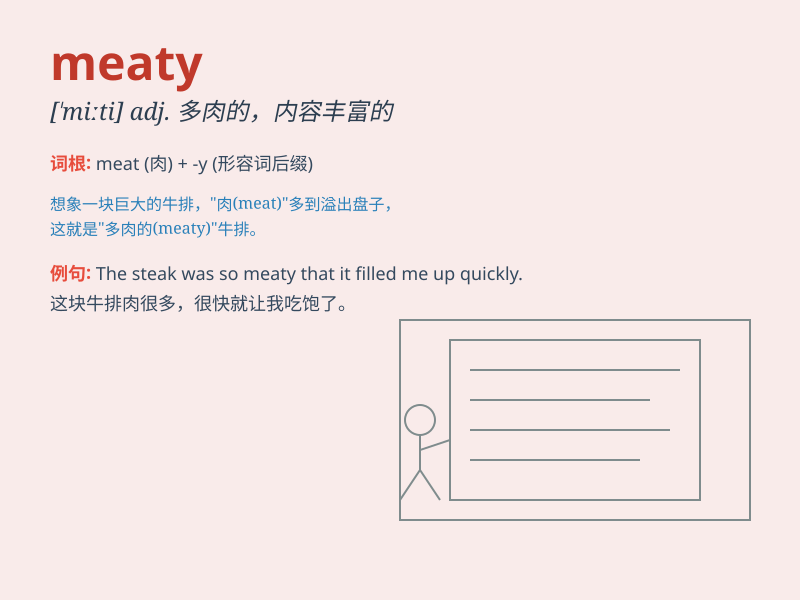

## meaty

**英音:** _[\'miːtɪ]_ **美音:** _[\'miti]_

**译义:** *adj.肉的*

### 短语

+ **meaty issue:** _重要的问题_

+ **meaty topic:** _有实质内容的话题_

+ **meaty discussion:** _有深度的讨论_

+ **meaty role:** _重要的角色_

+ **meaty paragraph:** _内容丰富的段落_

### 例句

#### 例句1

> **The book offers meaty insights into the subject.**

**中文翻译:** 这本书对这个主题提供了有价值的深刻见解。

**单词释义:** 有价值的；内容丰富的

#### 例句2

> **This steak is very meaty and satisfying.**

**中文翻译:** 这块牛排肉很多，令人满足。

**单词释义:** 多肉的；富含肉的

#### 例句3

> **The discussion was meaty and covered many important points.**

**中文翻译:** 这次讨论很有实质内容，涵盖了许多重要的点。

**单词释义:** 有实质内容的；重要的

### 背诵小故事

> A hungry mouse was looking for food. It finally found a big piece of
cheese that was very meaty. The mouse was so happy and ate it all. Now
you know\'meaty\' means full of or like meat.

**一只饥饿的老鼠正在寻找食物。它最终找到了一大块肉很多的奶酪。老鼠非常高兴，把它全吃了。现在你知道'meaty'意思是充满肉的或像肉的。**

### 图义

