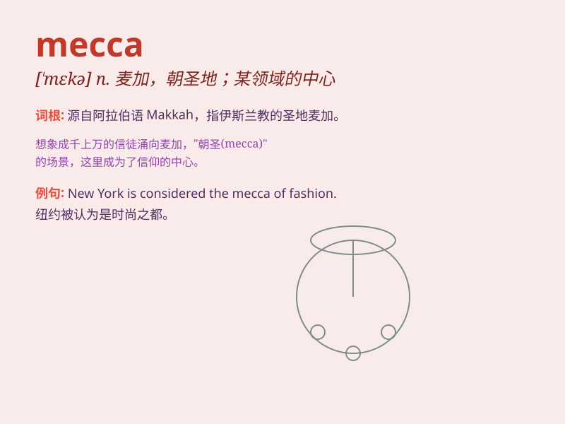

## mecca

**英音:** _[ˈmekə]_ **美音:** _[ˈmɛkə]_

**译义:** *n.麦加（伊斯兰教圣地）；许多人渴望去的地方*

### 短语

+ **Mecca pilgrimage:** _麦加朝圣_

+ **Mecca of something:** _某事物的胜地；某事物的热门地点_

+ **reach Mecca:** _到达麦加_

+ **Mecca bound:** _前往麦加_

+ **Mecca for tourists:** _游客的麦加（热门旅游目的地）_

### 例句

#### 例句1

> **Mecca is a holy city for Muslims.**

**中文翻译:** 麦加是穆斯林的圣城。

**单词释义:**
麦加（伊斯兰教创始人穆罕默德的诞生地，是伊斯兰教圣地之一）

#### 例句2

> **This place has become a mecca for tourists.**

**中文翻译:** 这个地方已经成为游客的胜地。

**单词释义:** 胜地；热门去处

#### 例句3

> **The fashion show turned the city into a mecca for style
lovers.**

**中文翻译:** 这场时装秀把这座城市变成了时尚爱好者的向往之地。

**单词释义:** 令人向往的地方

### 背诵小故事

> A young traveler was lost and desperate. Then he found a place called
Mecca, which was full of kind people and resources. It became his
salvation. Mecca means a place that attracts many people, a destination
of great importance.

**一位年轻的旅行者迷路了，非常绝望。然后他发现了一个叫麦加的地方，那里充满了善良的人和资源。它成了他的救星。麦加指吸引很多人的地方，一个非常重要的目的地。**

### 图义

