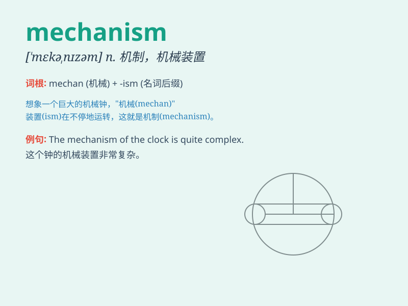

## mechanism

**英音:** _[\'mek(ə)nɪz(ə)m]_ **美音:** _[\'mɛkənɪzəm]_

**译义:** *n.机械装置,机构,机制*

### 短语

+ **market mechanism:** _市场机制_

+ **feedback mechanism:** _反馈机制_

+ **operating mechanism:** _运行机制；操作机制_

+ **defense mechanism:** _防御机制_

+ **transmission mechanism:** _传动机构；传导机制_

### 例句

#### 例句1

> **The mechanism of the clock is very complex.**

**中文翻译:** 这个钟的机械装置非常复杂。

**单词释义:** 机械装置

#### 例句2

> **The body has a defense mechanism against disease.**

**中文翻译:** 身体具有抵御疾病的防御机制。

**单词释义:** 机制；机理

#### 例句3

> **The mechanism by which brain cells store memories is not fully
understood.**

**中文翻译:** 脑细胞储存记忆的机制尚未被完全理解。

**单词释义:** 机制

### 背诵小故事

>
想象一个机器人，它的身体内部有各种复杂的零件和线路，这些零件和线路协同工作，让机器人能够行动和执行任务。这一整套的组合就像\'mechanism\'，是一种机械装置或运作方式。

**想象一个机器人，其内部复杂的零件和线路组合成的运作系统就像mechanism，即机械装置或运作方式。**

### 图义

