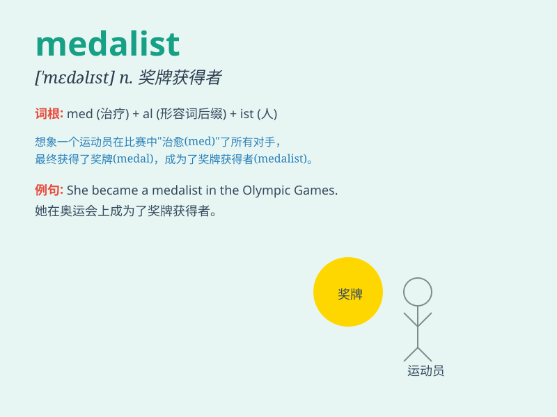

## medalist

**英音:** _[ˈmɛdlɪst]_ **美音:** _[ˈmɛdəlɪst]_

**译义:** *n.设计奖章者,受领奖章的人*

### 短语

+ **gold medalist:** _金牌获得者_

+ **silver medalist:** _银牌获得者_

+ **bronze medalist:** _铜牌获得者_

+ **Olympic medalist:** _奥运奖牌获得者_

+ **world medalist:** _世界奖牌获得者_

### 例句

#### 例句1

> **She is a gold medalist in the Olympic Games.**

**中文翻译:** 她是奥运会的金牌获得者。

**单词释义:** 金牌获得者

#### 例句2

> **The young athlete dreams of becoming a medalist one day.**

**中文翻译:** 这位年轻的运动员梦想有一天能成为奖牌获得者。

**单词释义:** 奖牌获得者

#### 例句3

> **The medalist received a standing ovation from the crowd.**

**中文翻译:** 这位奖牌获得者得到了人群的起立鼓掌。

**单词释义:** 奖牌获得者

### 背诵小故事

> In the big sports competition, Tom was very excited. He trained hard
every day and finally became a medalist. The shiny medal around his neck
made him feel proud and happy.

**在大型体育比赛中，汤姆非常兴奋。他每天刻苦训练，最终成为了奖牌获得者。挂在他脖子上闪闪发光的奖牌让他感到骄傲和开心。**

### 图义

