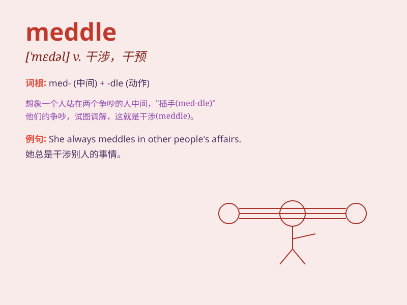

## meddle

**英音:** _[\'med(ə)l]_ **美音:** _[\'mɛdl]_

**译义:** *v.管闲事*

### 短语

+ **meddle in:** _干涉；干预_

+ **meddle with:** _乱动；摆弄_

+ **not meddle:** _不干涉；不插手_

+ **stop meddling:** _停止干涉_

+ **carelessly meddle:** _随意插手_

### 例句

#### 例句1

> **Don\'t meddle in my affairs!**

**中文翻译:** 别干涉我的事！

**单词释义:** 干涉；插手

#### 例句2

> **She always meddles when it\'s not necessary.**

**中文翻译:** 她总是在不必要的时候插手。

**单词释义:** 插手；干预

#### 例句3

> **You should not meddle with other people\'s private lives.**

**中文翻译:** 你不应该干涉别人的私生活。

**单词释义:** 干涉；管闲事

### 背诵小故事

>
小明总是喜欢meddle别人的事情，比如未经允许就帮同学修改作业。结果同学们都很生气，小明这才明白不该随意插手他人事务。

**小明总是喜欢插手别人的事情，比如未经允许就帮同学修改作业。结果同学们都很生气，小明这才明白不该随意插手他人事务。**

### 图义

