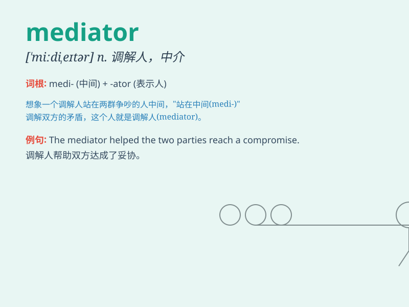

## mediator

**英音:** _[\'miːdɪeɪtə]_ **美音:** _[\'midɪetɚ]_

**译义:**
*n.调停者,仲裁人,[宗]中保(指耶稣,\<\<圣经.新约>>中称他是上帝和人之间的中保)*

### 短语

+ **labour mediator:** _劳动调解员_

+ **peace mediator:** _和平调解人_

+ **marriage mediator:** _婚姻调解人_

+ **commercial mediator:** _商业调解员_

+ **dispute mediator:** _纠纷调解人_

### 例句

#### 例句1

> **The mediator was able to resolve the conflict between the two
parties.**

**中文翻译:** 这位调解人能够解决双方之间的冲突。

**单词释义:** 调解人；调停者

#### 例句2

> **She acted as a mediator in the labor dispute.**

**中文翻译:** 她在这场劳动纠纷中充当了调解人。

**单词释义:** 调解人；调停者

#### 例句3

> **The mediator\'s role is to facilitate communication and find
common ground.**

**中文翻译:** 调解人的作用是促进沟通并找到共同点。

**单词释义:** 调解人；调停者

### 背诵小故事

>
想象一下，在一场激烈的争吵中，双方互不相让。这时出现了一位智慧的中间人（mediator），他耐心倾听双方的诉求，巧妙地调解，最终让双方达成和解。

**想象在争吵中，出现一位智慧的中间人，耐心倾听并调解，最终让双方和解。**

### 图义

