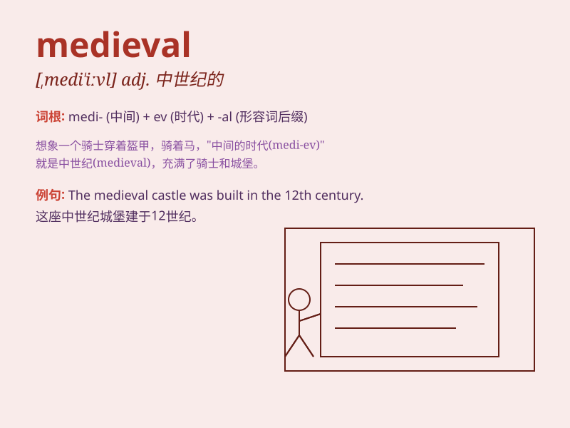

## medieval

**英音:** _[ˌmedɪˈi:vl]_ **美音:** _[ˌmɪdɪ\'ivəl]_

**译义:** *adj.中世纪的,仿中世纪的,老式的,\<贬>原始的*

### 短语

+ **medieval history:** _中世纪历史_

+ **medieval art:** _中世纪艺术_

+ **medieval castle:** _中世纪城堡_

+ **medieval literature:** _中世纪文学_

+ **medieval town:** _中世纪城镇_

### 例句

#### 例句1

> **The castle is a fine example of medieval architecture.**

**中文翻译:** 这座城堡是中世纪建筑的典范。

**单词释义:** 中世纪的

#### 例句2

> **She has a deep interest in medieval history.**

**中文翻译:** 她对中世纪历史有着浓厚的兴趣。

**单词释义:** 中世纪的

#### 例句3

> **The town retains much of its medieval charm.**

**中文翻译:** 该镇保留了大部分中世纪的魅力。

**单词释义:** 中世纪的

### 背诵小故事

> In a medieval town, a brave knight fought against evil to protect the
people. The town had old castles and narrow streets. It was a time of
knights, princesses, and epic battles. Remember, \'medieval\' takes you
to that old world.

**在一个中世纪的城镇里，一位勇敢的骑士与邪恶势力战斗以保护人民。这个城镇有古老的城堡和狭窄的街道。那是一个有骑士、公主和史诗般战斗的时代。记住，'medieval'带你走进那个古老的世界。**

### 图义

