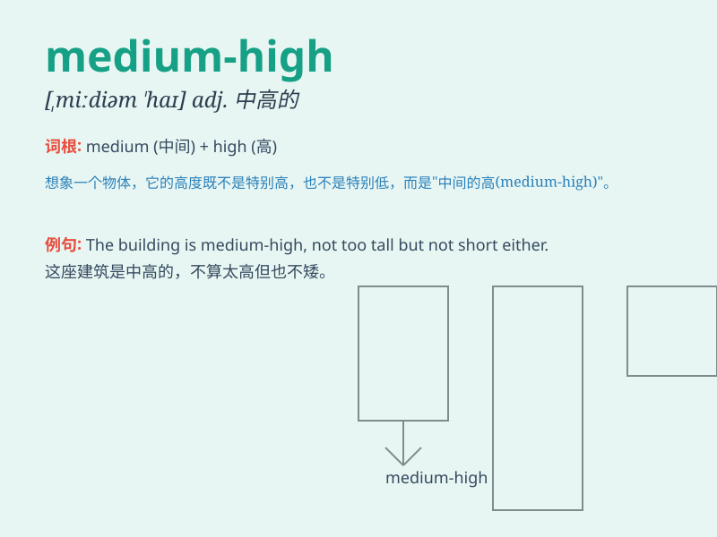

## medium-high

**英音:** _[ˌmiːdiəm ˈhaɪ]_ **美音:** _[ˌmiːdiəm ˈhaɪ]_

**译义:** *adj. 中等高度的；中高音的*

### 短语

+ **medium-high temperature:** _中高温_

+ **medium-high pressure:** _中高压_

+ **medium-high speed:** _中高速_

+ **medium-high frequency:** _中高频_

+ **medium-high intensity:** _中高强度_

### 例句

#### 例句1

> **The temperature is expected to be in the medium-high range
tomorrow.**

**中文翻译:** 预计明天的温度将处于中高范围。

**单词释义:** 中高的

#### 例句2

> **She achieved a medium-high score on the exam.**

**中文翻译:** 她在考试中取得了中高的分数。

**单词释义:** 中高的

#### 例句3

> **The quality of this product is medium-high, but the price is
relatively reasonable.**

**中文翻译:** 这个产品的质量属于中高，但价格相对合理。

**单词释义:** 中高的

### 背诵小故事

> Imagine a race where the finish line is at a medium-high position.
Not too high that it\'s impossible to reach, but high enough to require
some effort. Just like this, \'medium-high\' means a level that is
moderately above average.

**想象一场比赛，终点线处于中等偏高的位置。不是高到无法到达，但也足够高需要付出一些努力。就像这样，\'medium-high\'
表示中等偏上的水平。**

### 图义

