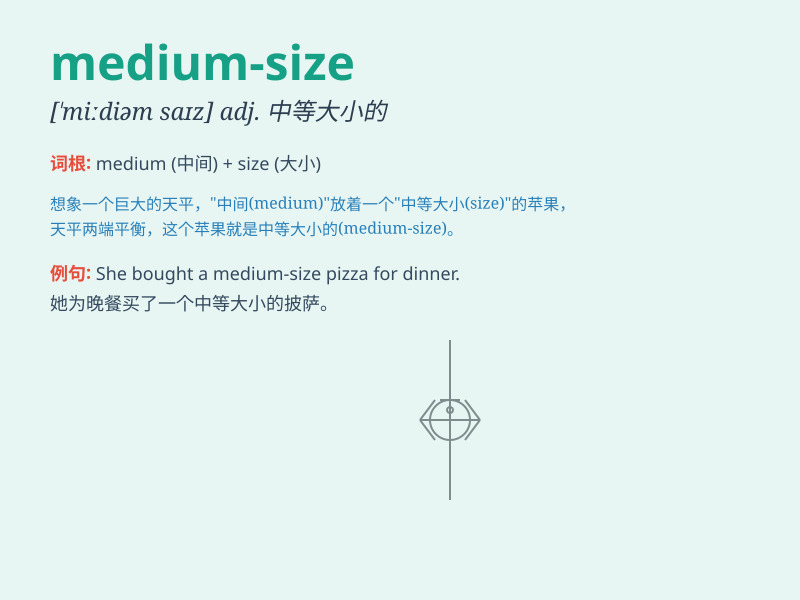

## medium-size

**英音:** _[ˈmiːdiəm ˈsaɪz]_ **美音:** _[ˈmiːdiəm
ˈsaɪz]_

**译义:** *形容词，中等大小的，中号的；由两个词组成，medium
意为中等的，size 意为大小、尺寸，连用表示尺寸上属于中等范畴的*

### 短语

+ **medium-size company:** _中型公司_

+ **medium-size city:** _中等规模的城市_

+ **medium-size enterprise:** _中型企业_

+ **medium-size project:** _中等规模的项目_

+ **medium-size town:** _中等大小的城镇_

### 例句

#### 例句1

> **The company is looking for a medium-size office space to
rent.**

**中文翻译:** 这家公司正在寻找一个中等大小的办公空间来租用。

**单词释义:** 中等大小的

#### 例句2

> **She bought a medium-size handbag for her daily use.**

**中文翻译:** 她买了一个中等大小的手提包用于日常使用。

**单词释义:** 中等大小的

#### 例句3

> **We need a medium-size car for our family trip.**

**中文翻译:** 我们的家庭旅行需要一辆中等大小的汽车。

**单词释义:** 中等大小的

### 背诵小故事

> One day, I went to a store and needed to buy a table. The salesperson
showed me a medium-size table that was neither too big nor too small. It
was just the right size for my room. So, I knew \'medium-size\' means in
the middle range of size.

**有一天，我去一家商店想买张桌子。售货员给我展示了一张中等大小的桌子，既不太大也不太小。它对我的房间来说尺寸刚刚好。所以，我知道了\'medium-size\'意思是处于大小的中间范围。**

### 图义

