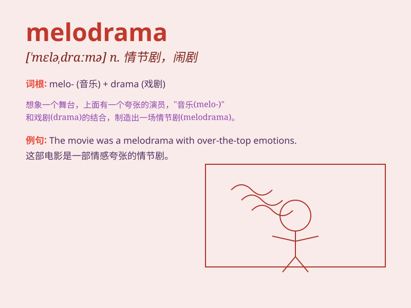

## melodrama

**英音:** _[\'melə(ʊ)drɑːmə]_ **美音:** _[\'mɛlədrɑmə]_

**译义:** *n.情节剧*

### 短语

+ **soap melodrama:** _肥皂剧式的情节剧_

+ **family melodrama:** _家庭情节剧_

+ **historical melodrama:** _历史情节剧_

+ **romantic melodrama:** _浪漫情节剧_

+ **emotional melodrama:** _情感情节剧_

### 例句

#### 例句1

> **The movie was a typical melodrama with over-the-top emotions and
predictable plot twists.**

**中文翻译:**
这部电影是一部典型的情节剧，情感夸张，情节曲折可想而知。

**单词释义:** 情节剧

#### 例句2

> **She accused him of creating a melodrama out of a simple
misunderstanding.**

**中文翻译:** 她指责他出于一个简单的误会而编造了一场情节剧。

**单词释义:** 情节剧；戏剧性事件

#### 例句3

> **The play was dismissed by critics as mere melodrama.**

**中文翻译:** 该剧被评论家斥为纯粹的情节剧。

**单词释义:** 情节剧；传奇剧

### 背诵小故事

> A young actor was always chosen for melodrama roles. One day, he got
lost in a big theater. When found, he was singing a sad song, just like
in a melodrama. That\'s how he remembered the word - meaning an
exaggerated, emotional drama.

**一位年轻演员总是被选去演情节剧。有一天，他在一个大剧院里迷路了。被找到时，他正在唱一首悲伤的歌，就像在情节剧中一样。这就是他记住这个词的方式 -
意思是夸张的、情感丰富的戏剧。**

### 图义

