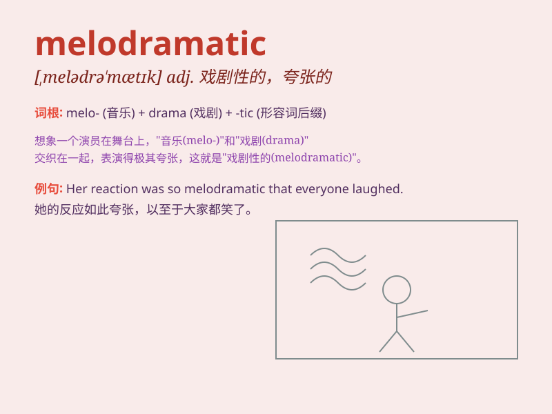

## melodramatic

**英音:** _[melədrə\'mætɪk]_ **美音:**
_[,mɛlədrə\'mætɪk]_

**译义:** *adj.情节剧的*

### 短语

+ **melodramatic plot:** _情节夸张的剧情_

+ **melodramatic performance:** _夸张的表演_

+ **melodramatic scene:** _戏剧性的场景_

+ **melodramatic story:** _夸张的故事_

+ **melodramatic character:** _戏剧化的角色_

### 例句

#### 例句1

> **The actress gave a melodramatic performance in the play.**

**中文翻译:** 这位女演员在剧中表演了充满戏剧性的表演。

**单词释义:** 夸张的；情节剧式的

#### 例句2

> **His story was so melodramatic that it was hard to believe.**

**中文翻译:** 他的故事如此戏剧化，令人难以置信。

**单词释义:** 过于戏剧化的；夸张做作的

#### 例句3

> **The melodramatic movie made the audience roll their eyes.**

**中文翻译:** 这部充满戏剧性的电影让观众翻白眼。

**单词释义:** 情节剧式的；充满戏剧性的

### 背诵小故事

> A young actor always gave very melodramatic performances. One day, in
a play about love and loss, he exaggerated his emotions so much that the
audience laughed. Later, he learned to be more natural. Remember,
melodramatic means overly dramatic and exaggerated.

**一位年轻演员总是表演得很夸张。有一天，在一场关于爱与失去的戏剧中，他的情感表现得太过了，观众都笑了。后来，他学会了更自然些。记住，melodramatic
意思是过于戏剧化和夸张的。**

### 图义

