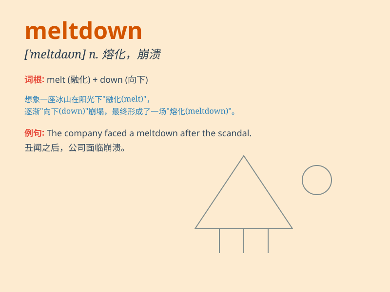

## meltdown

**英音:** _[ˈmeltdaʊn]_ **美音:** _[ˈmɛld.aʊn]_

**译义:** *n.融化，崩溃；核反应堆严重事故；精神崩溃*

### 短语

+ **nuclear meltdown:** _核反应堆堆芯熔毁_

+ **financial meltdown:** _金融危机_

+ **emotional meltdown:** _情绪崩溃_

+ **environmental meltdown:** _环境恶化_

+ **system meltdown:** _系统崩溃_

### 例句

#### 例句1

> **The nuclear reactor experienced a meltdown, causing a major
environmental disaster.**

**中文翻译:** 这座核反应堆发生了熔毁，造成了重大的环境灾难。

**单词释义:** 熔毁；核反应堆核心熔毁

#### 例句2

> **His emotional meltdown at work was unexpected and
embarrassing.**

**中文翻译:** 他在工作中的情绪崩溃出乎意料且令人尴尬。

**单词释义:** 崩溃；情绪失控

#### 例句3

> **The financial meltdown led to a global economic crisis.**

**中文翻译:** 金融崩溃导致了全球经济危机。

**单词释义:** 崩溃；经济或金融体系的严重崩溃

### 背诵小故事

> A nuclear power plant was on the verge of meltdown. Workers were in a
panic. But at the last moment, they managed to cool the reactors and
prevent a disaster. \'Meltdown\' here means a disastrous breakdown or
failure.

**一座核电站濒临熔毁。工人们惊慌失措。但在最后一刻，他们成功冷却了反应堆，避免了一场灾难。这里的\'meltdown\'意思是灾难性的崩溃或故障。**

### 图义

