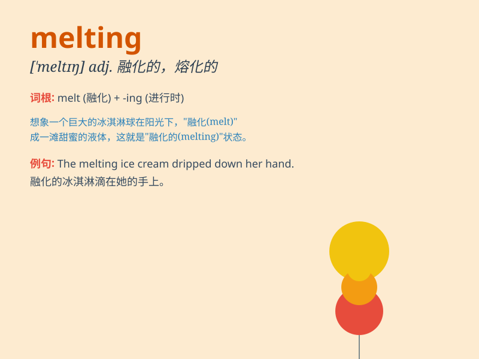

## melting

**英音:** _[\'meltɪŋ]_ **美音:** _[\'mɛltɪŋ]_

**译义:** *adj.熔化的,融化的,溶解的,混合的*

### 短语

+ **melting point:** _熔点_

+ **melting pot:**
_熔炉；大熔炉（指多种民族、多种思想等融合混杂的地方或状况）_

+ **melting ice:** _正在融化的冰_

+ **melting snow:** _正在融化的雪_

+ **melting temperature:** _熔化温度_

### 例句

#### 例句1

> **The sun was high in the sky, causing the ice to start
melting.**

**中文翻译:** 太阳高高挂在天空，冰开始融化。

**单词释义:** 融化

#### 例句2

> **Her heart was melting at the sight of the cute puppy.**

**中文翻译:** 看到这只可爱的小狗，她的心都融化了。

**单词释义:** 变得柔软、感动

#### 例句3

> **The chocolate bar was melting in his pocket.**

**中文翻译:** 巧克力棒在他口袋里融化了。

**单词释义:** 融化

### 背诵小故事

> In a hot summer, an ice cream was placed outside. The sun was so
strong that the ice cream started melting. Its shape changed, and drops
of sweet liquid fell to the ground. Poor ice cream!

**在一个炎热的夏天，一支冰淇淋被放在外面。太阳太强烈了，冰淇淋开始融化。它的形状改变了，甜甜的液滴掉到了地上。可怜的冰淇淋！**

### 图义

