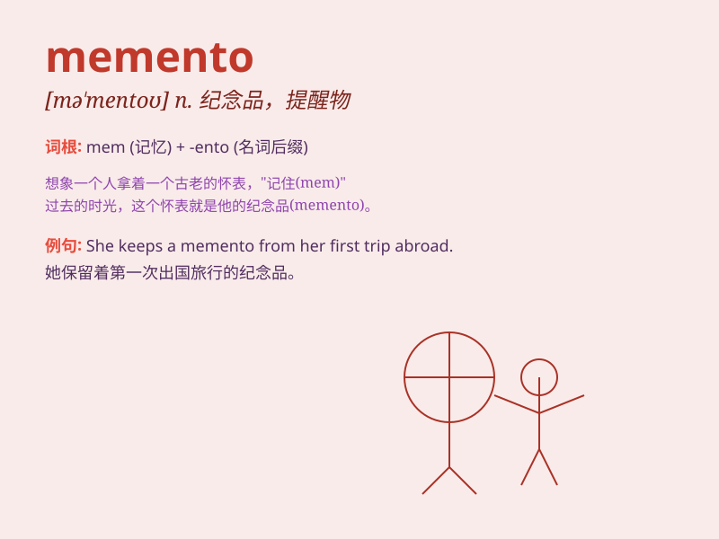

## memento

**英音:** _[məˈmentəʊ]_ **美音:** _[məˈmɛntoʊ]_

**译义:** *n.纪念品*

### 短语

+ **keepsake memento:** _纪念品_

+ **souvenir memento:** _纪念物_

+ **personal memento:** _个人纪念品_

+ **cherished memento:** _珍贵的纪念品_

+ **sentimental memento:** _情感上的纪念品_

### 例句

#### 例句1

> **She kept the old photo as a memento of her childhood.**

**中文翻译:** 她保留了这张旧照片作为童年的纪念品。

**单词释义:** 纪念品

#### 例句2

> **The bracelet was a memento from her grandmother.**

**中文翻译:** 这只手镯是她祖母送给她的纪念品。

**单词释义:** 纪念品

#### 例句3

> **He gave her a small keychain as a memento of their trip.**

**中文翻译:** 他送给她一个小钥匙扣作为他们旅行的纪念品。

**单词释义:** 纪念品

### 背诵小故事

> A man was on a long journey. Before leaving, his wife gave him a
small keychain as a memento. Whenever he felt lonely, looking at the
keychain reminded him of her love and made him brave.

**一个男人正在长途旅行。临行前，他的妻子给了他一个小钥匙链作为纪念品。每当他感到孤独时，看着这个钥匙链就会想起她的爱，让他变得勇敢。**

### 图义

