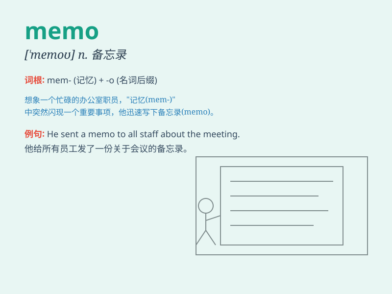

## memo

**英音:** _[\'meməʊ]_ **美音:** _[\'mɛmo]_

**译义:** *n.备忘录*

### 短语

+ **memo pad:** _便笺簿_

+ **memo paper:** _备忘录纸_

+ **write a memo:** _写一份备忘录_

+ **memo book:** _备忘录本_

+ **send a memo:** _发送一份备忘录_

### 例句

#### 例句1

> **I wrote a memo to remind myself of the meeting.**

**中文翻译:** 我写了一份备忘录来提醒自己这次会议。

**单词释义:** 备忘录；便条

#### 例句2

> **The boss sent a memo to all the employees.**

**中文翻译:** 老板给所有员工发了一份备忘录。

**单词释义:** 备忘录

#### 例句3

> **Please read the memo carefully before taking any action.**

**中文翻译:** 在采取任何行动之前，请仔细阅读该备忘录。

**单词释义:** 备忘录

### 背诵小故事

>
有一天，老板让小明写一份重要的备忘录（memo），小明认真完成后交给了老板。老板看后很满意，夸小明的
memo 条理清晰。从此，小明记住了 memo 这个单词。

**有一天，老板让小明写一份重要的备忘录，小明完成后老板很满意，小明借此记住了这个单词。**

### 图义

