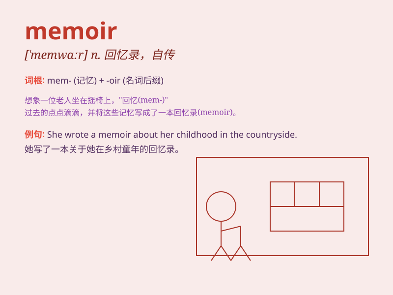

## memoir

**英音:** _[\'memwɑː]_ **美音:** _[\'mɛmwɑr]_

**译义:** *n.论文集*

### 短语

+ **memoir writing:** _回忆录写作_

+ **personal memoir:** _个人回忆录_

+ **historical memoir:** _历史回忆录_

+ **memoir collection:** _回忆录集_

+ **celebrity memoir:** _名人回忆录_

### 例句

#### 例句1

> **She published a memoir of her childhood in the countryside.**

**中文翻译:** 她出版了一本关于她在乡村度过的童年的回忆录。

**单词释义:** 回忆录

#### 例句2

> **The memoir offers a rare glimpse into the life of a
celebrity.**

**中文翻译:** 这本回忆录让我们得以难得一睹名人的生活。

**单词释义:** 回忆录

#### 例句3

> **His memoir detailed his experiences during the war.**

**中文翻译:** 他的回忆录详细描述了他在战争期间的经历。

**单词释义:** 回忆录

### 背诵小故事

> A famous writer was struggling to remember his past experiences. Then
he decided to write them down in a memoir. As he did, the memories
became clear and he shared his wonderful life journey with the world.

**一位著名作家努力回忆他过去的经历。然后他决定把它们写在一本回忆录里。当他这样做时，记忆变得清晰，他与世界分享了他精彩的人生旅程。**

### 图义

