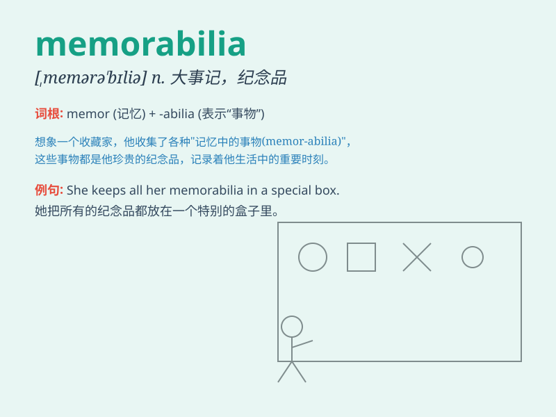

## memorabilia

**英音:** _[,mem(ə)rə\'bɪlɪə]_ **美音:**
_[,mɛmərə\'bɪlɪə]_

**译义:** *n.大事记*

### 短语

+ **collect memorabilia:** _收集纪念品_

+ **sports memorabilia:** _体育纪念品_

+ **movie memorabilia:** _电影纪念品_

+ **music memorabilia:** _音乐纪念品_

+ **historical memorabilia:** _历史纪念品_

### 例句

#### 例句1

> **The museum has a vast collection of sports memorabilia.**

**中文翻译:** 博物馆收藏了大量的体育纪念品。

**单词释义:** 纪念品

#### 例句2

> **She keeps all the concert memorabilia in a special box.**

**中文翻译:** 她将所有音乐会纪念品放在一个特殊的盒子里。

**单词释义:** 纪念品

#### 例句3

> **The store sells various kinds of movie memorabilia.**

**中文翻译:** 商店出售各种电影纪念品。

**单词释义:** 纪念品

### 背诵小故事

> A famous singer held a huge concert. After the show, fans collected
all kinds of items related to the event, like signed posters and special
T-shirts. These items were called memorabilia, things worth remembering
and keeping.

**一位著名歌手举办了一场盛大的演唱会。演出结束后，歌迷们收集了各种与该活动相关的物品，比如签名海报和特别的
T 恤。这些物品被称为纪念品，是值得记住和保留的东西。**

### 图义

