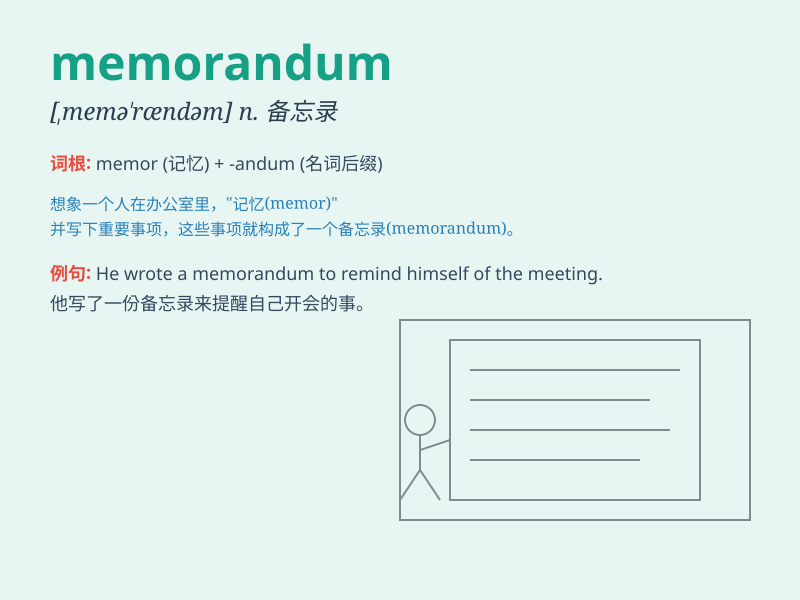

## memorandum

**英音:** _[memə\'rændəm]_ **美音:** _[,mɛmə\'rændəm]_

**译义:** *n.备忘录,便笺,便函,买卖契约书*

### 短语

+ **memorandum of understanding:** _谅解备忘录_

+ **memorandum account:** _备忘账户_

+ **memorandum book:** _备忘录簿_

+ **memorandum cheque:** _备忘支票_

+ **memorandum invoice:** _备忘发票_

### 例句

#### 例句1

> **The boss asked me to draft a memorandum on the new project.**

**中文翻译:** 老板让我起草一份关于新项目的备忘录。

**单词释义:** 备忘录

#### 例句2

> **He signed the memorandum without reading it carefully.**

**中文翻译:** 他没有仔细阅读备忘录就签署了。

**单词释义:** 备忘录

#### 例句3

> **The memorandum was circulated among the staff for their
comments.**

**中文翻译:** 该备忘录已在工作人员中分发以征求意见。

**单词释义:** 备忘录

### 背诵小故事

>
小明在公司接到一个重要任务，老板让他写一份备忘录（memorandum），提醒大家会议的关键内容。小明认真完成，这份备忘录帮助同事们都记住了要点。

**小明写备忘录帮助同事记住要点的故事**

### 图义

