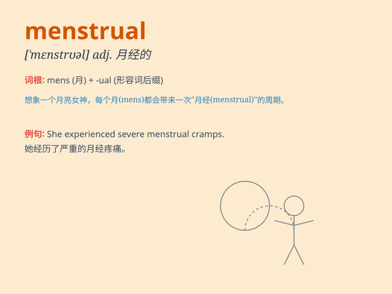

## menstrual

**英音:** _[\'menstrʊəl]_ **美音:** _[\'mɛnstruəl]_

**译义:** *adj.[生理]月经的,\<罕>一月一次的,每月的*

### 短语

+ **menstrual cycle:** _月经周期_

+ **menstrual disorder:** _月经失调_

+ **menstrual pain:** _痛经_

+ **menstrual flow:** _月经流量_

+ **menstrual hygiene:** _经期卫生_

### 例句

#### 例句1

> **She experiences severe menstrual cramps every month.**

**中文翻译:** 她每个月都会经历严重的月经痉挛。

**单词释义:** 月经的

#### 例句2

> **The doctor recommended some painkillers for her menstrual
discomfort.**

**中文翻译:** 医生给她推荐了一些止痛药来缓解她经期的不适。

**单词释义:** 月经的

#### 例句3

> **She needs to take time off work during her menstrual period.**

**中文翻译:** 她在月经期间需要请假。

**单词释义:** 月经的

### 背诵小故事

> A girl was very worried during her menstrual period. But her friend
told her it\'s a normal monthly process for women\'s bodies. So, she
felt better and learned to take care of herself during this time.

**一个女孩在她的经期非常担心。但她的朋友告诉她这是女性身体每月正常的过程。所以，她感觉好多了，并学会在这段时间照顾自己。**

### 图义

