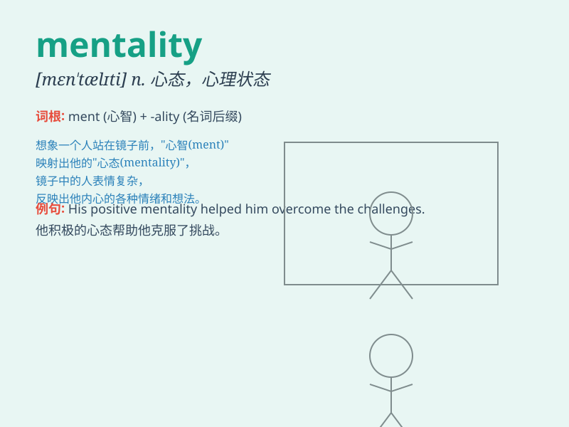

## mentality

**英音:** _[men\'tælɪtɪ]_ **美音:** _[mɛn\'tæləti]_

**译义:** *n.智力,精神,心理,思想情况*

### 短语

+ **fixed mentality:** _固定心态_

+ **growth mentality:** _成长心态_

+ **consumer mentality:** _消费者心态_

+ **competitive mentality:** _竞争心态_

+ **collective mentality:** _集体心态_

### 例句

#### 例句1

> **He has a positive mentality when facing challenges.**

**中文翻译:** 面对挑战时，他有着积极的心态。

**单词释义:** 心态

#### 例句2

> **The team needs to change their losing mentality.**

**中文翻译:** 球队需要改变输球的心态。

**单词释义:** 心态

#### 例句3

> **Her creative mentality allows her to come up with unique
ideas.**

**中文翻译:** 她的创作心态使她能够想出独特的想法。

**单词释义:** 心态

### 背诵小故事

> A young artist struggled to create masterpieces due to a fixed
mentality. But one day, he decided to change, opening his mind. Finally,
he achieved great success. Mentality here means the way of thinking or
attitude.

**一位年轻的艺术家由于固定的思维方式而难以创作出杰作。但有一天，他决定改变，敞开思想。最终，他取得了巨大的成功。这里
Mentality 指的是思维方式或态度。**

### 图义

