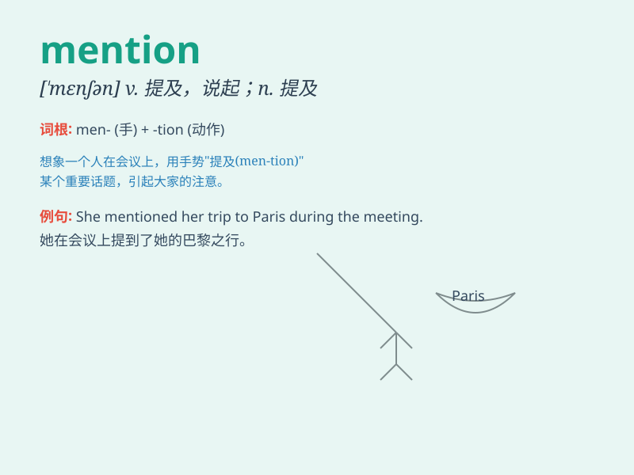

## mention

**英音:** _[\'menʃ(ə)n]_ **美音:** _[\'mɛnʃən]_

**译义:** *vt.提及,说起n.提及,说起v.论及,提及*

### 短语

+ **mention briefly:** _简要提及_

+ **mention casually:** _随便提及_

+ **mention repeatedly:** _反复提及_

+ **mention specifically:** _具体提及_

+ **mention incidentally:** _顺便提及_

### 例句

#### 例句1

> **He didn\'t mention the incident at all.**

**中文翻译:** 他根本没有提及这件事。

**单词释义:** 提及，说起

#### 例句2

> **She mentioned that she was going on vacation next week.**

**中文翻译:** 她提到她下周要去度假。

**单词释义:** 提到，说到

#### 例句3

> **Don\'t mention it when you see him.**

**中文翻译:** 当你见到他的时候，不要提起这件事。

**单词释义:** 提及，说起

### 背诵小故事

> One day, Tom was having a party. When his friend asked who was
coming, Tom mentioned several names, like Mary and John. His friend
understood clearly. Mention means to refer to or talk about someone or
something briefly.

**一天，汤姆在举办派对。当他的朋友问谁会来时，汤姆提到了几个名字，像玛丽和约翰。他的朋友就清楚明白了。mention
意思是简要地提及或谈论某人或某事。**

### 图义

