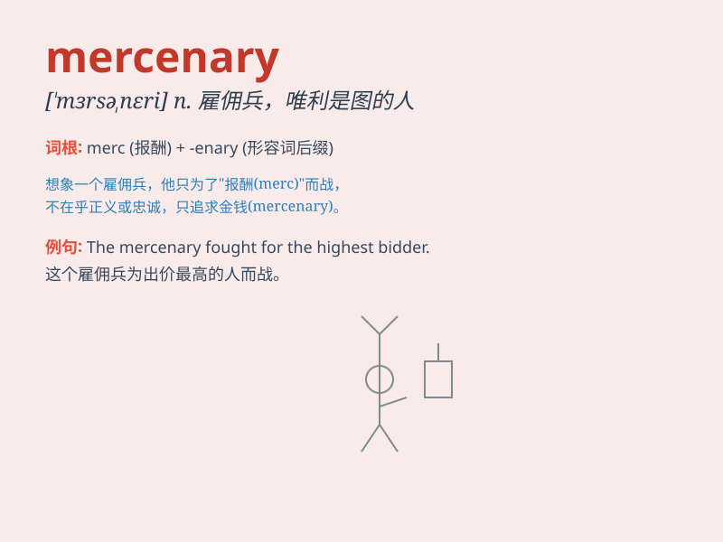

## mercenary

**英音:** _[\'mɜːsɪn(ə)rɪ]_ **美音:** _[\'mɝsənɛri]_

**译义:** *adj.唯利是图的*

### 短语

+ **mercenary soldier:** _雇佣兵_

+ **mercenary motive:** _唯利是图的动机_

+ **mercenary attitude:** _功利的态度_

+ **mercenary contract:** _雇佣合同_

+ **mercenary activity:** _雇佣活动_

### 例句

#### 例句1

> **He was accused of being a mercenary soldier, fighting only for
money.**

**中文翻译:** 他被指控为雇佣兵，只为金钱而战。

**单词释义:** 唯利是图的雇佣兵

#### 例句2

> **The company hired a mercenary consultant to handle the difficult
project.**

**中文翻译:** 公司聘请了一名雇佣兵顾问来处理这个困难的项目。

**单词释义:** 唯利是图的

#### 例句3

> **Her motives in the deal seemed mercenary rather than
altruistic.**

**中文翻译:** 她在这笔交易中的动机似乎是唯利是图而非利他主义。

**单词释义:** 唯利是图的

### 背诵小故事

> A brave knight was wrongly accused and lost his honor. To survive, he
became a mercenary. He fought for money, not for justice. But in the
end, he realized the emptiness of such a life and sought redemption.

**一位勇敢的骑士被冤枉并失去了荣誉。为了生存，他成为了雇佣兵。他为钱而战，而非正义。但最终，他意识到这种生活的空虚并寻求救赎。**

### 图义

