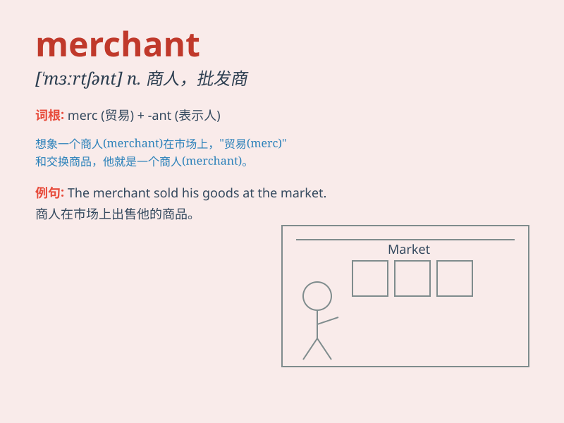

## merchant

**英音:** _[\'mɜːtʃ(ə)nt]_ **美音:** _[\'mɝtʃənt]_

**译义:** *n.商人,批发商,贸易商,店主adj.商业的,商人的*

### 短语

+ **merchant bank:** _商人银行_

+ **merchant marine:** _商船队_

+ **merchant ship:** _商船_

+ **merchant seaman:** _商船船员_

+ **merchant prince:** _商业巨头_

### 例句

#### 例句1

> **The merchant sold a variety of goods in his store.**

**中文翻译:** 商人在他的店里出售各种各样的商品。

**单词释义:** 商人

#### 例句2

> **She met a wealthy merchant on her trip.**

**中文翻译:** 她在旅途中遇到了一位富商。

**单词释义:** 商人

#### 例句3

> **The merchant was known for his honesty and fair prices.**

**中文翻译:** 这位商人以其诚实和公平的价格而闻名。

**单词释义:** 商人

### 背诵小故事

> A merchant was on a long journey to sell his precious goods. He faced
many challenges but never gave up. Finally, he made a great profit and
became famous. Remember, a merchant is someone who buys and sells
things.

**一位商人踏上了漫长的旅程去售卖他珍贵的货物。他面临诸多挑战但从不放弃。最终，他获得了巨大的利润并出名了。记住，商人就是买卖东西的人。**

### 图义

