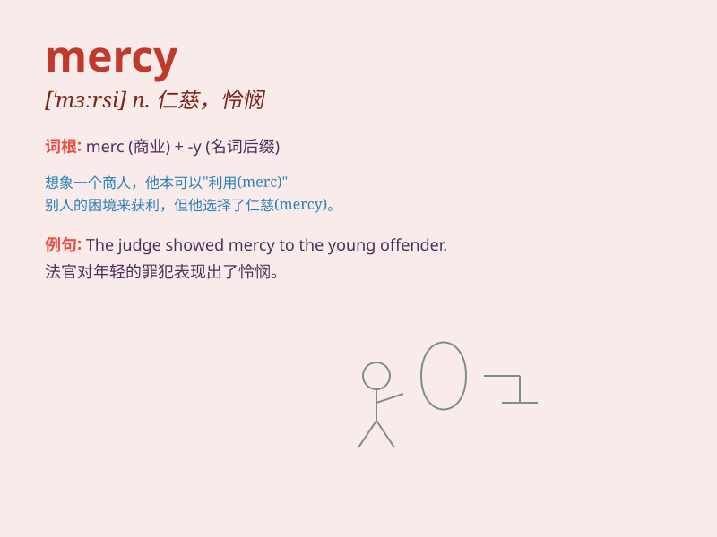

## mercy

**英音:** _[\'mɜːsɪ]_ **美音:** _[\'mɝsi]_

**译义:** *n.仁慈,宽恕,怜悯*

### 短语

+ **at the mercy of:** _任...摆布；在...前毫无办法_

+ **show mercy to:** _对...表示怜悯_

+ **have mercy on:** _对...怜悯_

+ **without mercy:** _毫不留情；残忍地_

+ **beg for mercy:** _乞求宽恕；求饶_

### 例句

#### 例句1

> **The criminal begged for mercy.**

**中文翻译:** 罪犯哀求饶命。

**单词释义:** 宽恕；仁慈

#### 例句2

> **They showed no mercy to their enemies.**

**中文翻译:** 他们对敌人毫不留情。

**单词释义:** 仁慈；怜悯

#### 例句3

> **It\'s a mercy she wasn\'t seriously hurt.**

**中文翻译:** 幸亏她没有受重伤。

**单词释义:** 幸运；侥幸

### 背诵小故事

> A poor thief was caught stealing. The kind king showed mercy and let
him go. The thief was very grateful and promised never to steal again.
\'Mercy\' means kindness and forgiveness when punishing someone.

**一个可怜的小偷在行窃时被抓住。善良的国王仁慈地放了他。小偷非常感激，并承诺再也不偷了。'mercy'这个词意思是在惩罚某人时表现出的仁慈和宽恕。**

### 图义

