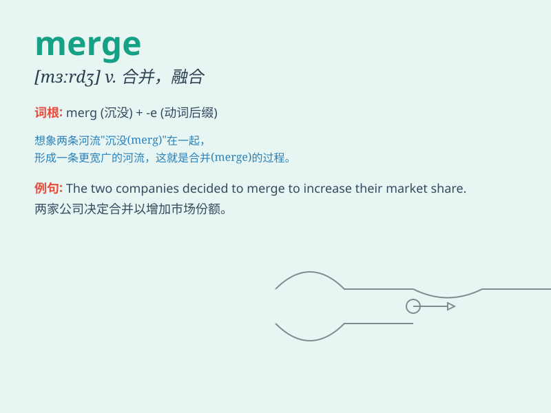

## merge

**英音:** _[mɜːdʒ]_ **美音:** _[mɝdʒ]_

**译义:** *v.合并,并入,结合,吞没,融合*

### 短语

+ **merge into:** _并入；融合到_

+ **merge with:** _与\...合并；与\...融合_

+ **merge together:** _合并在一起_

+ **merge smoothly:** _顺利合并_

+ **merge gradually:** _逐渐合并_

### 例句

#### 例句1

> **The two companies decided to merge to form a stronger entity.**

**中文翻译:** 两家公司决定合并，形成一个更强大的实体。

**单词释义:** 合并

#### 例句2

> **The small stream merges into the big river.**

**中文翻译:** 小溪汇入大河。

**单词释义:** 汇入

#### 例句3

> **Traffic merges smoothly on this highway.**

**中文翻译:** 这条高速公路上的交通顺畅。

**单词释义:** 汇流

### 背诵小故事

> 想象一下，有两条小溪欢快地流淌着。一条叫 A，一条叫
B。突然，它们在一个地方交汇，合二为一，成为了一条更大的溪流。这就像单词
merge，意思就是合并、融合。

**想象两条小溪交汇融合来记住 merge 这个表示合并、融合的单词**

### 图义

