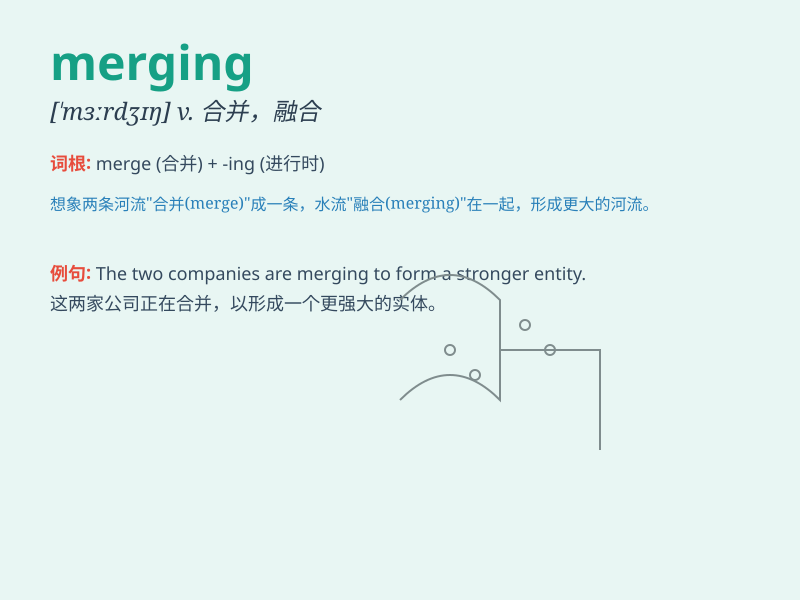

## merging

**英音:** _[\'mɜːdʒɪŋ]_ **美音:** _[\'mɜrdʒɪŋ]_

**译义:** *v. 合并, 融合, 结合*

### 短语

+ **merging traffic:** _合流交通_

+ **merging point:** _汇合点_

+ **merging companies:** _合并的公司_

+ **merging process:** _合并过程_

+ **data merging:** _数据合并_

### 例句

#### 例句1

> **The merging of the two companies created a powerful business
entity.**

**中文翻译:** 这两家公司的合并创造了一个强大的商业实体。

**单词释义:** 合并

#### 例句2

> **Traffic was disrupted due to the merging of several lanes.**

**中文翻译:** 由于几条车道的合并，交通受到了干扰。

**单词释义:** 合并；融合

#### 例句3

> **The merging of cultures can lead to new and exciting art
forms.**

**中文翻译:** 文化的融合能够催生新的、令人兴奋的艺术形式。

**单词释义:** 融合

### 背诵小故事

> A car was merging onto the highway. It smoothly joined the
fast-moving traffic. The driver was careful, making the merging process
safe. Remember, \'merging\' is like this car joining another flow.

**一辆汽车正在并入高速公路。它平稳地加入了快速行驶的车流。司机很小心，使得合并过程很安全。记住，'merging'就像这辆车加入另一种流动。**

### 图义

