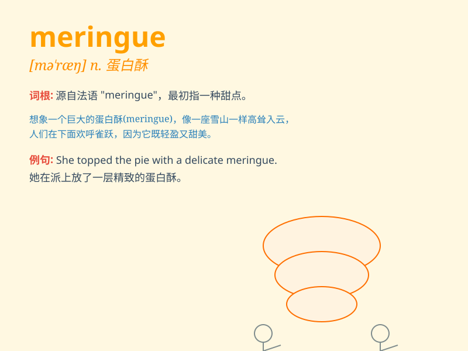

## meringue

**英音:** _[məˈriːŋ]_ **美音:** _[məˈræŋ]_

**译义:** *n.蛋白酥皮(一种由蛋白和糖制成的甜点配料)*

### 短语

+ **lemon meringue:** _柠檬蛋白酥皮馅饼_

+ **meringue pie:** _蛋白酥皮馅饼_

+ **chocolate meringue:** _巧克力蛋白酥_

+ **meringue kiss:** _蛋白酥吻_

+ **meringue topping:** _蛋白酥皮顶料_

### 例句

#### 例句1

> **The chef decorated the cake with meringue swirls.**

**中文翻译:** 厨师用蛋白酥皮卷装饰了蛋糕。

**单词释义:** 蛋白酥皮

#### 例句2

> **She made a delicious meringue pie for the party.**

**中文翻译:** 她为聚会做了一个美味的蛋白酥皮派。

**单词释义:** 蛋白酥皮

#### 例句3

> **The meringue on top of the dessert was light and crispy.**

**中文翻译:** 甜点上面的蛋白酥皮又轻又脆。

**单词释义:** 蛋白酥皮

### 背诵小故事

> Once upon a time, a chef was making a special dessert. The key
ingredient was a fluffy and sweet topping called\'meringue\'. It looked
like white clouds and tasted amazing. People loved this dessert with the
magical meringue.

**从前，有一位厨师正在制作一份特别的甜点。关键的配料是一种松软又甜美的顶部装饰，叫做'蛋白酥皮'。它看起来像白云，味道棒极了。人们喜欢这种有着神奇蛋白酥皮的甜点。**

### 图义

