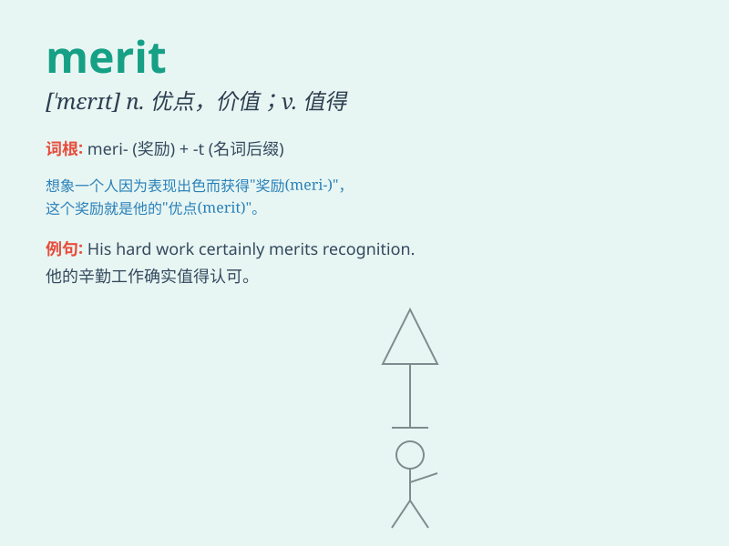

## merit

**英音:** _[\'merɪt]_ **美音:** _[\'mɛrɪt]_

**译义:** *n.优点,价值v.有益于*

### 短语

+ **merit award:** _优秀奖；功绩奖_

+ **merit system:** _功绩制；考绩制度_

+ **on its merits:** _根据事物本身的优缺点；就其本身而言_

+ **have merit:** _有优点；有价值_

+ **merit and demerit:** _优缺点_

### 例句

#### 例句1

> **The book has considerable merit.**

**中文翻译:** 这本书有相当大的价值。

**单词释义:** 价值；优点

#### 例句2

> **She was awarded a scholarship on merit.**

**中文翻译:** 她因成绩优秀获得了奖学金。

**单词释义:** 优点；长处；功绩

#### 例句3

> **The plan\'s merits outweigh its disadvantages.**

**中文翻译:** 这个计划的优点超过了缺点。

**单词释义:** 优点；长处

### 背诵小故事

> A poor student named Tom worked very hard and achieved excellent
grades. His efforts were recognized as having merit. Eventually, he
received a scholarship for his outstanding performance.

**一个叫汤姆的穷学生学习非常努力并取得了优异的成绩。他的努力被认为是有价值的。最终，他因出色的表现获得了奖学金。**

### 图义

