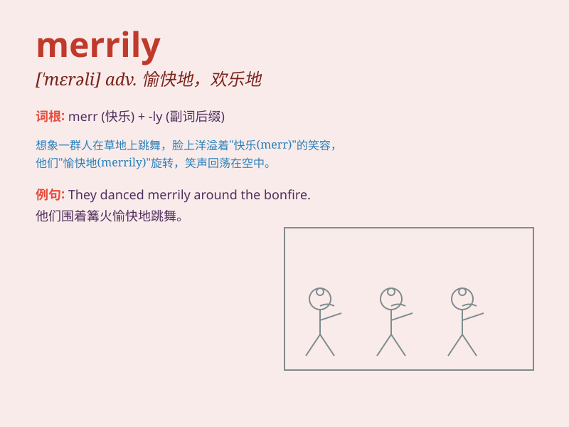

## merrily

**英音:** _[\'merɪlɪ]_ **美音:** _[\'mɛrəli]_

**译义:** *adv.愉快地,高兴地*

### 短语

+ **merrily singing:** _欢快地歌唱_

+ **merrily dancing:** _快乐地跳舞_

+ **merrily chatting:** _愉快地聊天_

+ **merrily laughing:** _开心地大笑_

+ **merrily playing:** _欢乐地玩耍_

### 例句

#### 例句1

> **The children were playing merrily in the park.**

**中文翻译:** 孩子们在公园里欢快地玩耍。

**单词释义:** 欢快地

#### 例句2

> **She sang merrily as she walked along the street.**

**中文翻译:** 她沿街走着，欢快地唱着歌。

**单词释义:** 欢快地

#### 例句3

> **The bells rang merrily on Christmas Day.**

**中文翻译:** 圣诞节那天，钟声欢快地响着。

**单词释义:** 欢快地

### 背诵小故事

> A little girl was skating merrily on the ice rink. She laughed and
sang, enjoying the moment without a care. Her joy was infectious, making
everyone around her smile.

**一个小女孩在溜冰场欢快地滑着冰。她笑着唱着，无忧无虑地享受着这一刻。她的快乐富有感染力，让周围的每个人都笑了。**

### 图义

