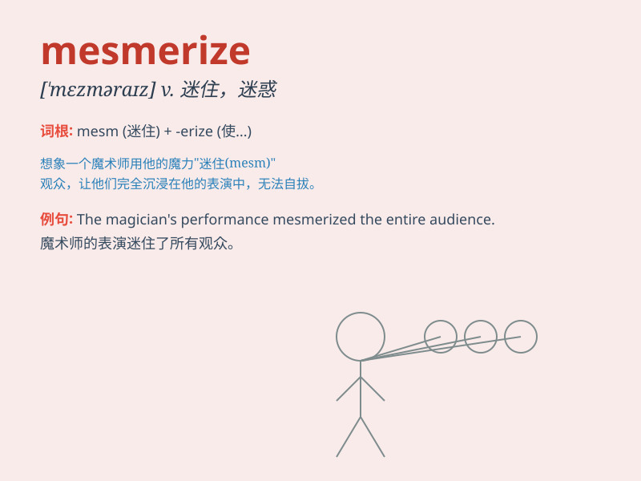

## mesmerize

**英音:** _[ˈmezməraɪz]_ **美音:** _[ˈmezməraɪz]_

**译义:** *v.施催眠术*

### 短语

+ **mesmerize someone:** _迷住某人；使某人着迷_

+ **be mesmerized by:** _被\...\...迷住；为\...\...所吸引_

+ **mesmerize the audience:** _使观众着迷_

+ **mesmerize with charm:** _以魅力迷住_

+ **mesmerize completely:** _完全迷住_

### 例句

#### 例句1

> **The magician\'s performance mesmerized the audience.**

**中文翻译:** 魔术师的表演让观众着迷。

**单词释义:** 使着迷

#### 例句2

> **Her beauty mesmerized everyone at the party.**

**中文翻译:** 她的美丽在聚会上让每个人都着迷。

**单词释义:** 使着迷

#### 例句3

> **The story of the hero mesmerized the children.**

**中文翻译:** 英雄的故事让孩子们着迷。

**单词释义:** 使着迷

### 背诵小故事

> A magician was performing on the stage. His charming tricks and
expressions mesmerized the audience. Everyone was so focused and
couldn\'t take their eyes off him.

**一位魔术师在舞台上表演。他迷人的戏法和表情让观众着迷。每个人都如此专注，眼睛无法从他身上移开。**

### 图义

