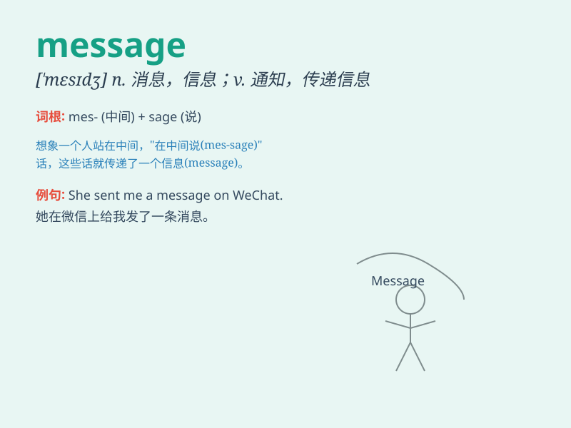

## message

**英音:** _[\'mesɪdʒ]_ **美音:** _[\'mɛsɪdʒ]_

**译义:**
*n.消息,通讯,讯息,音讯,差使,广告词,预言,教训vt.通知vi.带信息*

### 短语

+ **send a message:** _发送消息_

+ **leave a message:** _留言_

+ **take a message:** _捎口信_

+ **get the message:** _领会意思_

+ **convey a message:** _传达消息_

### 例句

#### 例句1

> **I sent her a message to congratulate her on her success.**

**中文翻译:** 我给她发了一条消息祝贺她取得成功。

**单词释义:** 消息；信息

#### 例句2

> **The message of the film is very positive.**

**中文翻译:** 这部电影所传达的信息非常积极。

**单词释义:** （书、电影等的）要旨，主题思想

#### 例句3

> **There\'s an important message for you from your teacher.**

**中文翻译:** 老师有一条重要的口信给你。

**单词释义:** 口信；留言

### 背诵小故事

> One day, a little bird was sent by its owner to deliver a message to
a friend far away. The bird flew carefully, holding the important
message in its beak. Finally, it reached the destination successfully
and delivered the message.

**有一天，一只小鸟被它的主人派去给远方的朋友传递一个消息。小鸟小心翼翼地飞着，嘴里衔着重要的消息。最后，它成功到达目的地并传递了消息。**

### 图义

