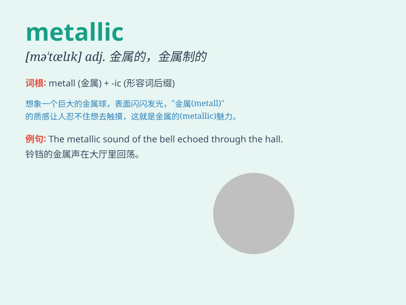

## metallic

**英音:** _[mɪ\'tælɪk]_ **美音:** _[mə\'tælɪk]_

**译义:** *adj.金属(性)的*

### 短语

+ **metallic element:** _金属元素_

+ **metallic luster:** _金属光泽_

+ **metallic sound:** _金属声_

+ **metallic paint:** _金属漆_

+ **metallic taste:** _金属味_

### 例句

#### 例句1

> **The car has a metallic blue finish.**

**中文翻译:** 该车采用金属蓝色饰面。

**单词释义:** 金属的；含金属的

#### 例句2

> **She wore a metallic dress to the party.**

**中文翻译:** 她穿着金属色连衣裙参加聚会。

**单词释义:** 有金属特性的；像金属的

#### 例句3

> **The sound of the machine was harsh and metallic.**

**中文翻译:** 机器的声音刺耳而金属。

**单词释义:** 金属般的

### 背诵小故事

> A brave astronaut was exploring a strange planet. He found a shiny
object that looked metallic. When he touched it, it felt cold and hard,
just like metal. Later, he learned it was a precious metallic mineral.

**一位勇敢的宇航员正在探索一个陌生的星球。他发现了一个看起来有金属质感的闪亮物体。当他触摸它时，感觉又冷又硬，就像金属一样。后来，他得知这是一种珍贵的金属矿物质。**

### 图义

