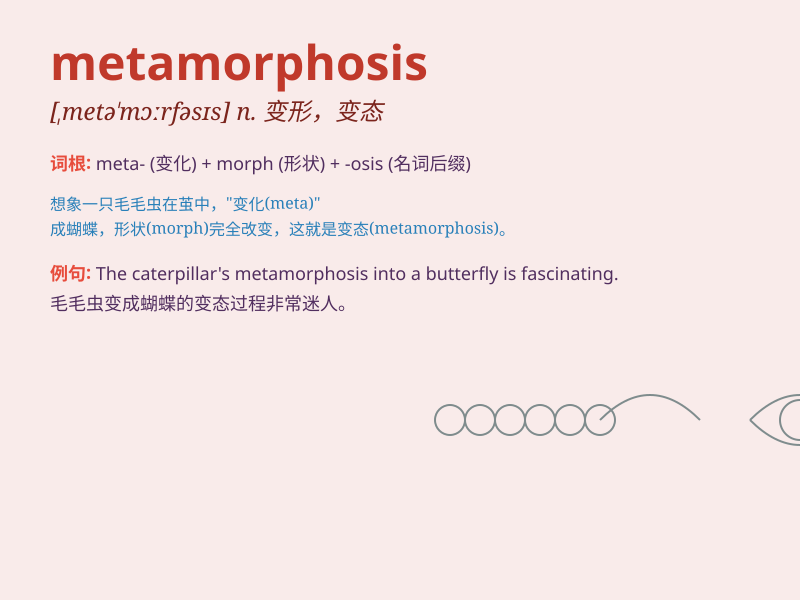

## metamorphosis

**英音:** _[,metə\'mɔːfəsɪs; ,metəmɔː\'fəʊsɪs]_ **美音:**
_[\'mɛtə\'mɔrfəsɪs]_

**译义:** *n.变形*

### 短语

+ **undergo metamorphosis:** _经历变形；经历蜕变_

+ **complete metamorphosis:** _完全变态_

+ **insect metamorphosis:** _昆虫变态_

+ **metamorphosis stage:** _变态阶段_

+ **metamorphosis process:** _变态过程_

### 例句

#### 例句1

> **The caterpillar undergoes a remarkable metamorphosis to become a
butterfly.**

**中文翻译:** 毛毛虫经历了惊人的蜕变，变成了蝴蝶。

**单词释义:** 变态，蜕变

#### 例句2

> **The city has undergone a metamorphosis in the past few
decades.**

**中文翻译:** 在过去的几十年里，这座城市经历了翻天覆地的变化。

**单词释义:** 巨变，彻底变化

#### 例句3

> **His personality seemed to go through a metamorphosis after the
accident.**

**中文翻译:** 事故发生后，他的性格似乎发生了转变。

**单词释义:** 转变，变化

### 背诵小故事

> A caterpillar dreams of a big change. One day, it enters a cocoon.
After a long wait, it undergoes metamorphosis and emerges as a beautiful
butterfly. The process is magical and full of surprises.

**一只毛毛虫梦想着巨大的改变。有一天，它进入了一个茧。经过漫长的等待，它经历了变态发育，变成了一只美丽的蝴蝶。这个过程神奇又充满惊喜。**

### 图义

