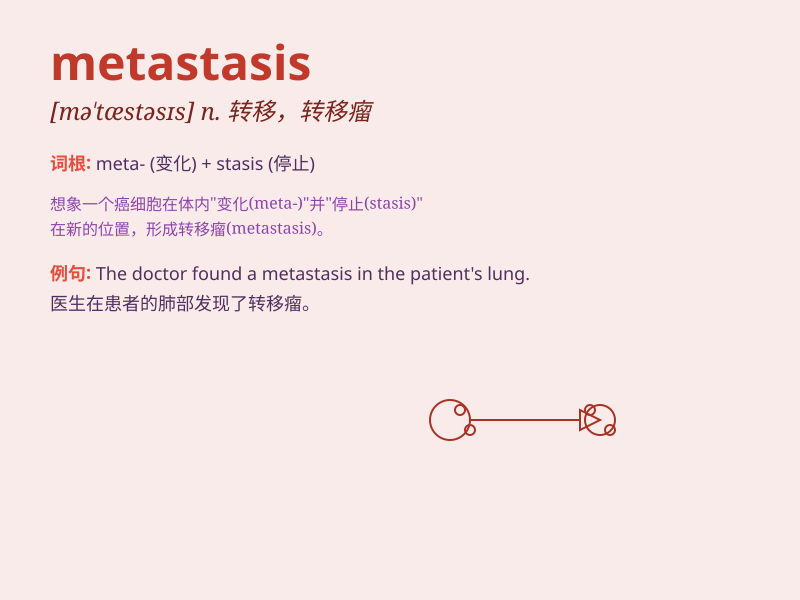

## metastasis

**英音:** _[mɪ\'tæstəsɪs]_ **美音:** _[mə\'tæstəsɪs]_

**译义:** *n.转移*

### 短语

+ **bone metastasis:** _骨转移_

+ **liver metastasis:** _肝转移_

+ **lymph node metastasis:** _淋巴结转移_

+ **pulmonary metastasis:** _肺转移_

+ **cerebral metastasis:** _脑转移_

### 例句

#### 例句1

> **The cancer had reached an advanced stage with metastasis to
multiple organs.**

**中文翻译:** 癌症已发展到晚期并转移至多个器官。

**单词释义:** 转移（指癌细胞从原发部位扩散到其他部位）

#### 例句2

> **Metastasis is a common complication of malignant tumors.**

**中文翻译:** 转移是恶性肿瘤常见的并发症。

**单词释义:** 转移（现象）

#### 例句3

> **The doctor was concerned about the possibility of metastasis in
the patient\'s condition.**

**中文翻译:** 医生担心患者的病情是否存在转移的可能性。

**单词释义:** 转移

### 背诵小故事

> A brave doctor was studying a strange disease. He found that the
cancer cells could spread and change locations, which he called
\'metastasis\'. It was like tiny invaders moving to new places in the
body.

**一位勇敢的医生在研究一种奇怪的疾病。他发现癌细胞能够扩散并改变位置，他把这称为'转移'。这就像微小的侵略者在身体里转移到新的地方。**

### 图义

