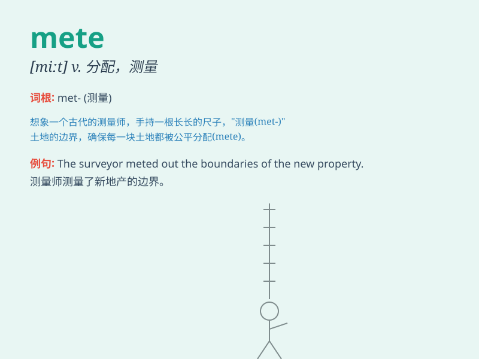

## mete

**英音:** _[miːt]_ **美音:** _[mit]_

**译义:** *n.边界v.给予*

### 短语

+ **mete out:** _给予，分配；施加（惩罚等）_

+ **mete justice:** _伸张正义_

+ **mete punishment:** _给予惩罚_

+ **mete rewards:** _给予奖励_

+ **mete kindness:** _施予善意_

### 例句

#### 例句1

> **The judge will mete out justice to the offender.**

**中文翻译:** 法官将给罪犯伸张正义。

**单词释义:** 给予，分配（处罚、奖赏等）

#### 例句2

> **She meted out praise to the hardworking students.**

**中文翻译:** 她对勤奋的同学们表示了赞扬。

**单词释义:** 给予，分配（表扬等）

#### 例句3

> **The punishment was meted out according to the law.**

**中文翻译:** 已依法予以处罚。

**单词释义:** 给予，施加（惩罚）

### 背诵小故事

> A king wanted to mete out rewards and punishments fairly. He measured
the achievements of his subjects precisely. The word \'mete\' means to
distribute or allot.

**一位国王想要公平地分配奖赏和惩罚。他精确地衡量臣民的功绩。单词\'mete\'意思是分配或给予。**

### 图义

