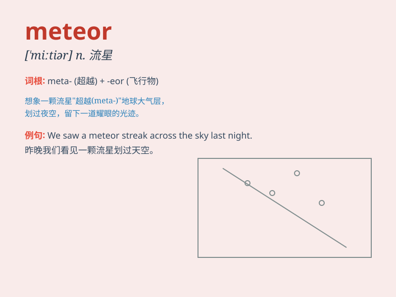

## meteor

**英音:** _[\'miːtɪə; -tɪɔː]_ **美音:** _[\'mitɪɚ]_

**译义:** *n.流星,大气现象*

### 短语

+ **meteor shower:** _流星雨_

+ **meteor stream:** _流星群_

+ **meteor impact:** _流星撞击_

+ **meteor crater:** _陨星坑_

+ **shooting meteor:** _飞逝的流星_

### 例句

#### 例句1

> **A meteor streaked across the night sky.**

**中文翻译:** 一颗流星划过夜空。

**单词释义:** 流星

#### 例句2

> **The meteor shower was a breathtaking sight.**

**中文翻译:** 流星雨的景象令人叹为观止。

**单词释义:** 流星

#### 例句3

> **He wished upon a meteor for good luck.**

**中文翻译:** 他向流星祈求好运。

**单词释义:** 流星

### 背诵小故事

> One night, while I was looking up at the sky, a bright object
suddenly streaked across. It was a meteor! It burned brightly for a
moment and then vanished. What a magical sight!

**一天晚上，当我仰望天空时，一个明亮的物体突然划过。那是一颗流星！它闪耀了一会儿然后消失了。多么神奇的景象！**

### 图义

