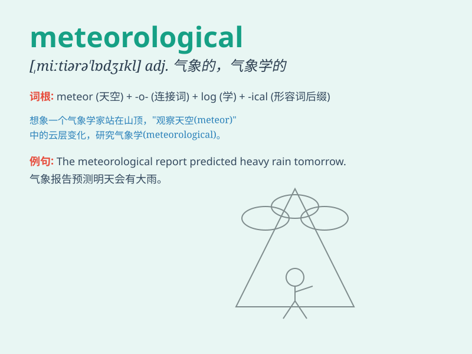

## meteorological

**英音:** _[ˌmiːtɪˈɒrəlɒdʒɪkl]_ **美音:**
_[ˌmiːtɪˈɔrəˈlɑːdʒɪkl]_

**译义:** *气象学的，与气象学有关的*

### 短语

+ **meteorological station:** _气象站_

+ **meteorological data:** _气象数据_

+ **meteorological conditions:** _气象条件_

+ **meteorological phenomenon:** _气象现象_

+ **meteorological forecast:** _气象预报_

### 例句

#### 例句1

> **The meteorological conditions were perfect for a picnic.**

**中文翻译:** 气象条件非常适合野餐。

**单词释义:** 气象的；与气象有关的

#### 例句2

> **Meteorological data is crucial for predicting natural
disasters.**

**中文翻译:** 气象数据对于预测自然灾害至关重要。

**单词释义:** 气象的；与气象有关的

#### 例句3

> **She studies meteorological phenomena in the university.**

**中文翻译:** 她在大学里研究气象现象。

**单词释义:** 气象的；与气象有关的

### 背诵小故事

> One day, a little boy was very interested in the sky. He wanted to
know why the weather changed. So he started to study meteorological
knowledge. He learned about clouds, winds, and rains. Finally, he
understood the mystery of nature.

**有一天，一个小男孩对天空非常感兴趣。他想知道天气为什么会变化。于是他开始学习气象学知识。他了解了云、风和雨。最终，他明白了大自然的奥秘。**

### 图义

