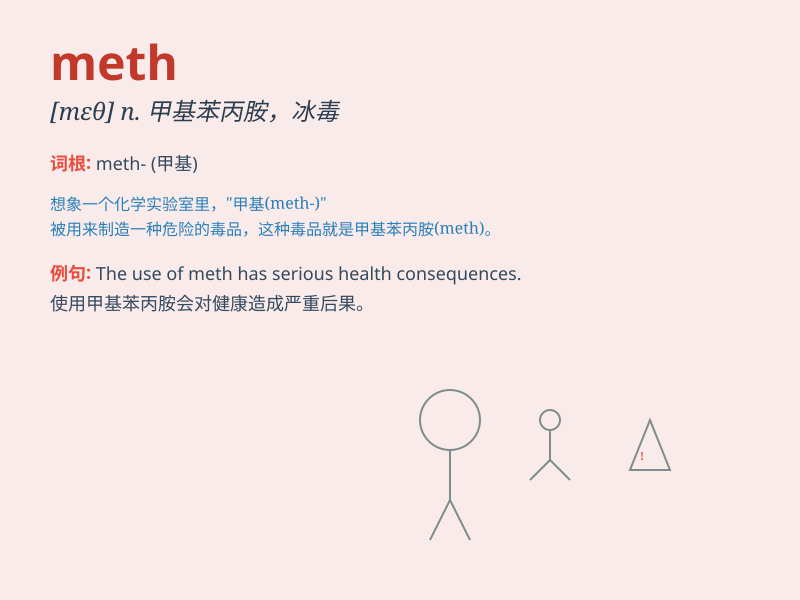

## meth

**英音:** _[meθ]_ **美音:** _[meθ]_

**译义:** *n.甲基；甲胺*

### 短语

+ **meth lab:** _冰毒实验室_

+ **meth addict:** _冰毒成瘾者_

+ **meth use:** _使用冰毒_

+ **meth production:** _冰毒生产_

+ **meth trafficking:** _冰毒贩卖_

### 例句

#### 例句1

> **He was arrested for dealing meth.**

**中文翻译:** 他因贩卖冰毒而被捕。

**单词释义:** 冰毒

#### 例句2

> **Meth addiction is a serious problem.**

**中文翻译:** 冰毒成瘾是一个严重的问题。

**单词释义:** 冰毒

#### 例句3

> **The police found a large amount of meth in his house.**

**中文翻译:** 警察在他的房子里发现了大量的冰毒。

**单词释义:** 冰毒

### 背诵小故事

> Imagine a scientist in a secret lab working on a powerful substance.
He calls it\'meth\'. But beware! It\'s dangerous and illegal.
Remember,\'meth\' is not something to mess with!

**想象一位科学家在一个秘密实验室里研究一种强大的物质。他称之为"meth"。但要小心！它是危险且非法的。记住，"meth"可不是能随便碰的！**

### 图义

