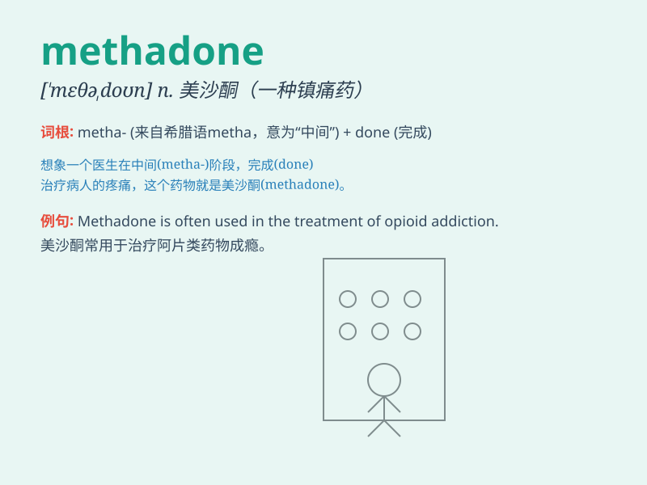

## methadone

**英音:** _null_ **美音:** _null_

**译义:** *null*

### 短语

+ **methadone maintenance:** _美沙酮维持治疗_

+ **methadone treatment:** _美沙酮疗法_

+ **methadone clinic:** _美沙酮诊所_

+ **methadone program:** _美沙酮项目_

+ **methadone dose:** _美沙酮剂量_

### 例句

#### 例句1

> **Methadone is often used in the treatment of heroin addiction.**

**中文翻译:** 美沙酮常用于海洛因成瘾的治疗。

**单词释义:** 美沙酮（一种镇痛药，也用于戒毒治疗）

#### 例句2

> **The doctor prescribed methadone to help the patient overcome the
addiction.**

**中文翻译:** 医生开了美沙酮来帮助患者克服毒瘾。

**单词释义:** 美沙酮

#### 例句3

> **She has been on a methadone maintenance program for several
months.**

**中文翻译:** 她已经参加美沙酮维持治疗计划好几个月了。

**单词释义:** 美沙酮

### 背诵小故事

> A patient was struggling with drug addiction. The doctor prescribed
methadone to help him recover. Methadone acted as a key to unlock his
path to a healthy life.

**一位患者正与毒瘾作斗争。医生开了美沙酮来帮助他康复。美沙酮就像是一把钥匙，开启了他走向健康生活的道路。**

### 图义

