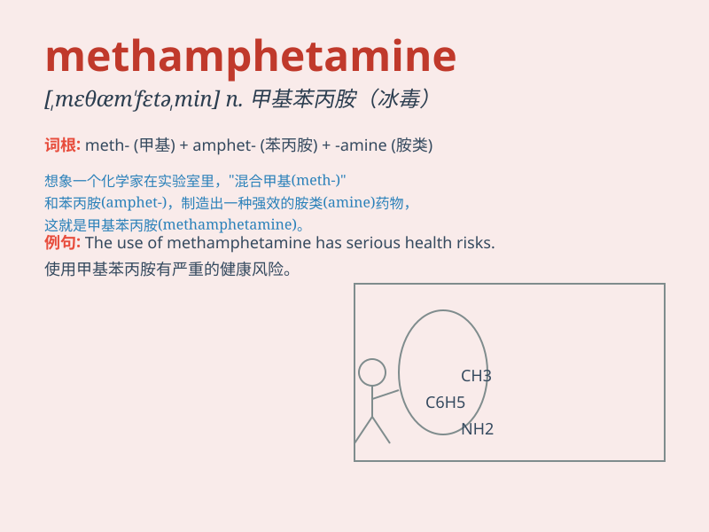

## methamphetamine

**英音:** _[,meθæm\'fetəmiːn; -ɪn]_ **美音:**
_[,mɛθæm\'fɛtəmin]_

**译义:** *n.[药]甲基苯丙胺,脱氧麻黄碱(中枢兴奋药)*

### 短语

+ **methamphetamine abuse:** _冰毒滥用_

+ **methamphetamine addiction:** _冰毒成瘾_

+ **methamphetamine trafficking:** _冰毒贩运_

+ **methamphetamine use disorder:** _冰毒使用障碍_

+ **methamphetamine production:** _冰毒生产_

### 例句

#### 例句1

> **He was arrested for possessing methamphetamine.**

**中文翻译:** 他因持有冰毒而被捕。

**单词释义:** 冰毒

#### 例句2

> **The use of methamphetamine can cause serious health problems.**

**中文翻译:** 使用甲基苯丙胺会导致严重的健康问题。

**单词释义:** 冰毒

#### 例句3

> **She struggled with addiction to methamphetamine for years.**

**中文翻译:** 多年来，她一直在与甲基苯丙胺成瘾作斗争。

**单词释义:** 冰毒

### 背诵小故事

> A detective was hunting for a criminal who was dealing in
methamphetamine. He followed clues and finally caught the culprit.
Remember, methamphetamine is a dangerous drug!

**一位侦探正在追捕一个贩卖冰毒（methamphetamine）的罪犯。他顺着线索，最终抓住了罪犯。记住，冰毒是一种危险的毒品！**

### 图义

