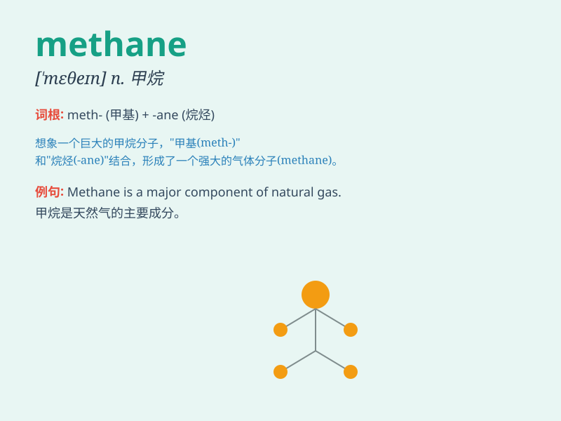

## methane

**英音:** _[\'miːθeɪn; \'meθeɪn]_ **美音:** _[\'mɛθen]_

**译义:** *n.[化]甲烷,沼气*

### 短语

+ **methane gas:** _甲烷气体_

+ **methane emission:** _甲烷排放_

+ **methane hydrate:** _甲烷水合物_

+ **methane production:** _甲烷生成_

+ **methane molecule:** _甲烷分子_

### 例句

#### 例句1

> **Methane is a major component of natural gas.**

**中文翻译:** 甲烷是天然气的主要成分。

**单词释义:** 甲烷

#### 例句2

> **The release of methane into the atmosphere contributes to global
warming.**

**中文翻译:** 甲烷释放到大气中会导致全球变暖。

**单词释义:** 甲烷

#### 例句3

> **Scientists are studying ways to reduce methane emissions from
livestock.**

**中文翻译:** 科学家正在研究减少牲畜甲烷排放的方法。

**单词释义:** 甲烷

### 背诵小故事

> One day, a scientist was studying a special gas. He called
it\'methane\'. It\'s like a hidden power in swamps and comes from
decomposed things. Now you remember\'methane\' as this mysterious gas!

**有一天，一位科学家在研究一种特殊的气体。他称之为"甲烷"。它就像沼泽里隐藏的力量，来自分解的东西。现在你记住"甲烷"就是这种神秘的气体！**

### 图义

