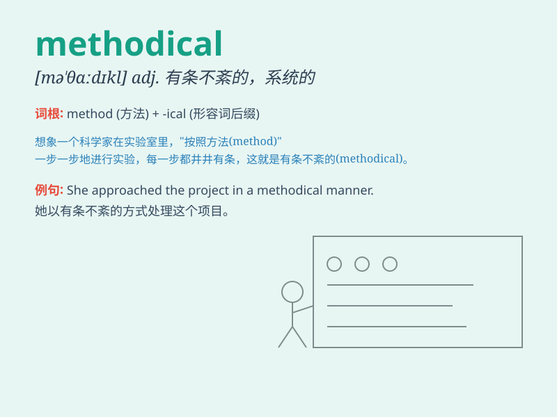

## methodical

**英音:** _[mɪ\'θɒdɪk(ə)l]_ **美音:** _[mə\'θɑdɪkl]_

**译义:** *adj.有方法的,有系统的*

### 短语

+ **methodical approach:** _有条理的方法_

+ **methodical investigation:** _有条理的调查_

+ **methodical process:** _有条理的过程_

+ **methodical analysis:** _有条理的分析_

+ **methodical study:** _有条理的研究_

### 例句

#### 例句1

> **He approached the problem in a methodical way, analyzing each
aspect carefully.**

**中文翻译:** 他有条不紊地处理这个问题，仔细分析每个方面。

**单词释义:** 有条理的；有条不紊的

#### 例句2

> **The detective was methodical in his investigation, leaving no
stone unturned.**

**中文翻译:** 侦探的调查很有条理，不遗余力。

**单词释义:** 有条不紊的；按部就班的

#### 例句3

> **Her methodical study habits helped her achieve excellent
grades.**

**中文翻译:** 她有条不紊的学习习惯帮助她取得了优异的成绩。

**单词释义:** 有条理的；有方法的

### 背诵小故事

> A detective was solving a case in a methodical way. He carefully
collected evidence, made detailed notes, and followed a strict plan. His
methodical approach finally led to the capture of the criminal.

**一位侦探正在有条不紊地侦破一个案件。他仔细收集证据，做详细笔记，并遵循严格的计划。他这种有条不紊的方法最终使罪犯落网。**

### 图义

