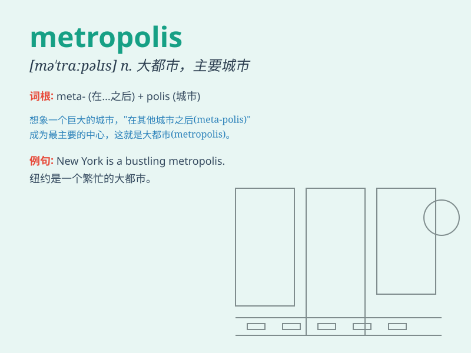

## metropolis

**英音:** _[mɪ\'trɒp(ə)lɪs]_ **美音:** _[mə\'trɑpəlɪs]_

**译义:** *n.首都,主要都市,都会,大主教教区,大城市*

### 短语

+ **global metropolis:** _全球大都市_

+ **metropolis center:** _大都市中心_

+ **industrial metropolis:** _工业大都市_

+ **metropolis area:** _大都市地区_

+ **commercial metropolis:** _商业大都市_

### 例句

#### 例句1

> **New York is one of the most famous metropolises in the world.**

**中文翻译:** 纽约是世界上最著名的大都市之一。

**单词释义:** 大都市

#### 例句2

> **The metropolis was crowded with tourists during the holiday
season.**

**中文翻译:** 假期期间，这座大都市挤满了游客。

**单词释义:** 大都市

#### 例句3

> **The rapid development of the metropolis has brought both
opportunities and challenges.**

**中文翻译:** 大都市的快速发展既带来了机遇，也带来了挑战。

**单词释义:** 大都市

### 背诵小故事

> Once upon a time, a young adventurer traveled to a huge city. People
called it a metropolis. It had tall buildings, busy streets, and
countless opportunities. The adventurer was amazed by the grandeur and
diversity of this metropolis.

**从前，有一位年轻的冒险家去到一个巨大的城市。人们称其为大都市。那里有高楼大厦、繁忙的街道和无数的机会。这位冒险家对这个大都市的宏伟和多样性感到惊叹。**

### 图义

