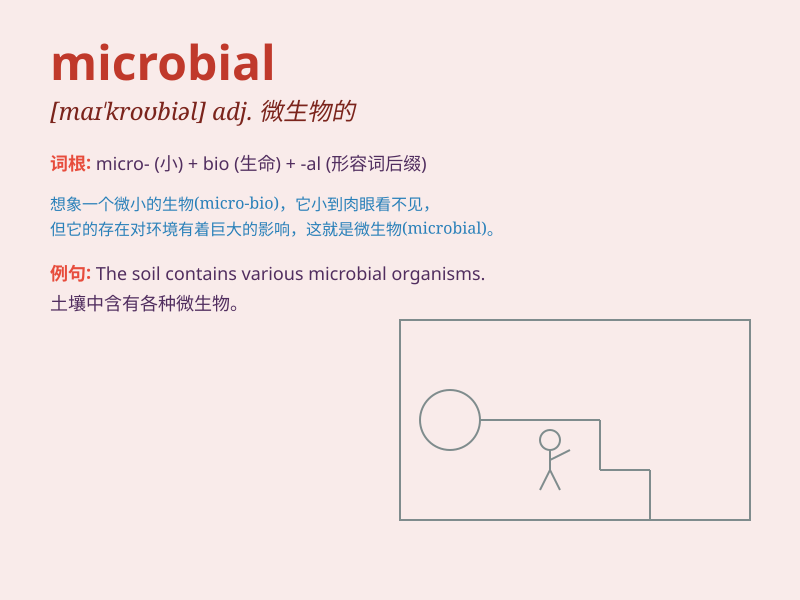

## microbial

**英音:** _[maɪ\'krəʊbɪəl]_ **美音:** _[maɪ\'krobɪəl]_

**译义:** *adj.微生物的,由细菌引起的*

### 短语

+ **microbial flora:** _微生物菌群_

+ **microbial growth:** _微生物生长_

+ **microbial infection:** _微生物感染_

+ **microbial metabolism:** _微生物代谢_

+ **microbial diversity:** _微生物多样性_

### 例句

#### 例句1

> **The soil contains a rich diversity of microbial life.**

**中文翻译:** 土壤中含有丰富多样的微生物生命。

**单词释义:** 微生物的

#### 例句2

> **Microbial activity plays a crucial role in decomposition.**

**中文翻译:** 微生物活动在分解过程中起着关键作用。

**单词释义:** 微生物的

#### 例句3

> **Scientists are studying the microbial population in the deep
sea.**

**中文翻译:** 科学家们正在研究深海中的微生物种群。

**单词释义:** 微生物的

### 背诵小故事

> Imagine a tiny world where microscopic creatures are having a party.
These little beings are called microbial. They are so small that you
need a powerful microscope to see them. They play and live in every
corner of our world.

**想象一个微小的世界，里面有微观生物正在举行派对。这些小小的生物被称为微生物。它们非常小，以至于你需要强大的显微镜才能看到它们。它们在我们世界的每个角落玩耍和生活。**

### 图义

