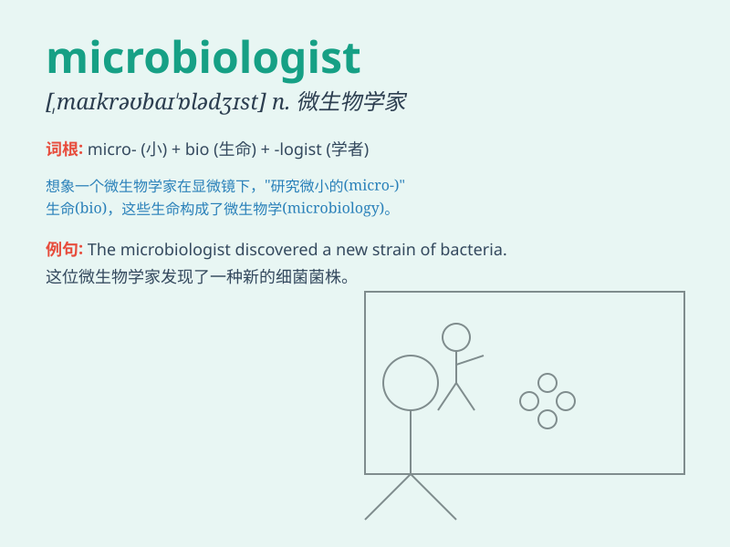

## microbiologist

**英音:** _[ˌmaɪkrəʊbaɪˈɒlədʒɪst]_ **美音:**
_[ˌmaɪkroʊbaɪˈɑːlədʒɪst]_

**译义:** *n.微生物学家*

### 短语

+ **Medical microbiologist:** _医学微生物学家_

+ **Research microbiologist:** _研究型微生物学家_

+ **Clinical microbiologist:** _临床微生物学家_

+ **Environmental microbiologist:** _环境微生物学家_

+ **Food microbiologist:** _食品微生物学家_

### 例句

#### 例句1

> **The microbiologist is conducting experiments to study the growth
of bacteria.**

**中文翻译:** 这位微生物学家正在进行实验以研究细菌的生长。

**单词释义:** 微生物学家

#### 例句2

> **She became a renowned microbiologist after years of research.**

**中文翻译:** 经过多年的研究，她成为了一位著名的微生物学家。

**单词释义:** 微生物学家

#### 例句3

> **The microbiologist discovered a new strain of virus.**

**中文翻译:** 这位微生物学家发现了一种新的病毒株。

**单词释义:** 微生物学家

### 背诵小故事

> A microbiologist named Lily was always in her lab, studying tiny
creatures. One day, she discovered a new microbe that could change the
world. Her passion for microbes made her a great microbiologist.

**一位名叫莉莉的微生物学家总是在她的实验室里，研究微小生物。有一天，她发现了一种能改变世界的新微生物。她对微生物的热情使她成为了一位出色的微生物学家。**

### 图义

