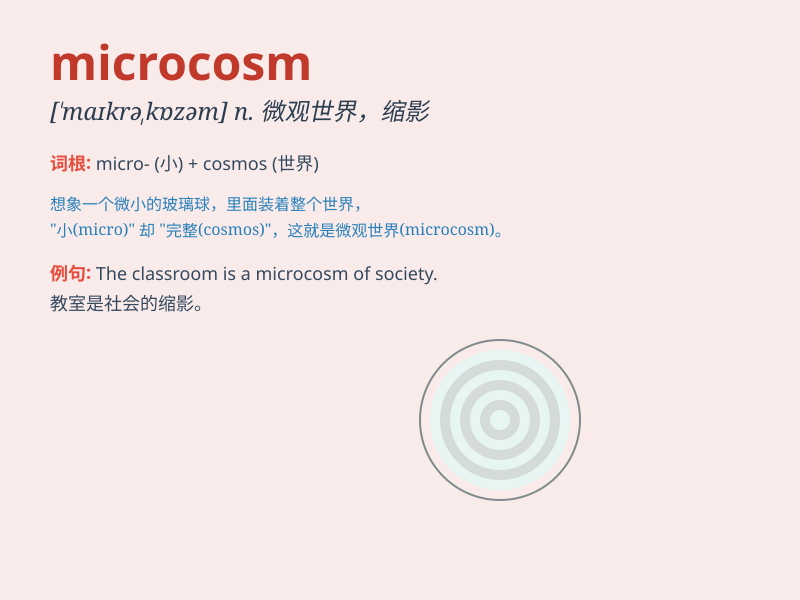

## microcosm

**英音:** _[\'maɪkrə(ʊ)kɒz(ə)m]_ **美音:**
_[\'maɪkrokɑzəm]_

**译义:** *n.微观世界*

### 短语

+ **a microcosm of society:** _社会的缩影_

+ **microcosm theory:** _微观世界理论_

+ **in a microcosm:** _在一个小天地里_

+ **microcosm environment:** _微观环境_

+ **create a microcosm:** _创造一个微观世界_

### 例句

#### 例句1

> **The school is a microcosm of society.**

**中文翻译:** 这所学校是社会的一个缩影。

**单词释义:** 缩影；微观世界

#### 例句2

> **The family is often seen as a microcosm of the larger
community.**

**中文翻译:** 家庭通常被视为更大社区的一个缩影。

**单词释义:** 缩影

#### 例句3

> **This small town is a microcosm of the changing economic landscape
of the country.**

**中文翻译:** 这个小镇是这个国家不断变化的经济格局的一个缩影。

**单词释义:** 缩影

### 背诵小故事

> Imagine a tiny village. Everyone and everything in it represents a
larger society. This village is like a microcosm, showing all the
elements and relationships of a big city in a small scale. It\'s a micro
world within a larger one.

**想象一个小村庄。村里的每个人和每件事都代表着一个更大的社会。这个村庄就像是一个微观世界，以小见大展现了大城市的所有元素和关系。它是大环境中的一个小世界。**

### 图义

