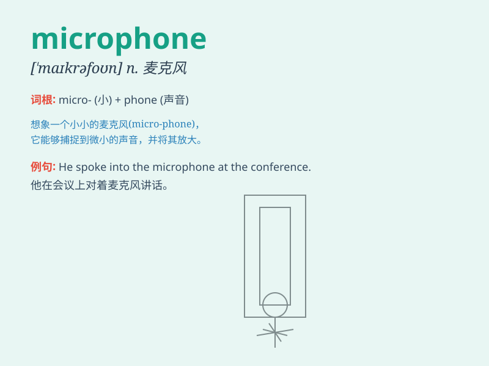

## microphone

**英音:** _[\'maɪkrəfəʊn]_ **美音:** _[\'maɪkrə\'fon]_

**译义:** *n.扩音器,麦克风*

### 短语

+ **wireless microphone:** _无线麦克风_

+ **handheld microphone:** _手持式麦克风_

+ **microphone stand:** _麦克风支架_

+ **condenser microphone:** _电容式麦克风_

+ **dynamic microphone:** _动圈式麦克风_

### 例句

#### 例句1

> **She sang beautifully into the microphone.**

**中文翻译:** 她对着麦克风唱得很美。

**单词释义:** 麦克风

#### 例句2

> **The speaker adjusted the microphone before starting his
speech.**

**中文翻译:** 演讲者在开始演讲之前调整了麦克风。

**单词释义:** 麦克风

#### 例句3

> **The microphone wasn\'t working properly, causing sound
issues.**

**中文翻译:** 麦克风无法正常工作，导致声音问题。

**单词释义:** 麦克风

### 背诵小故事

> A mouse was singing on the stage but no one could hear. So a kind
fairy gave it a microphone. With the microphone, the mouse\'s voice was
heard clearly. \'Microphone\' helps us hear tiny voices.

**一只老鼠在舞台上唱歌，但没人能听见。于是一位善良的仙女给了它一个麦克风。有了麦克风，老鼠的声音能被清晰听见了。'microphone'（麦克风）帮助我们听见微小的声音。**

### 图义

