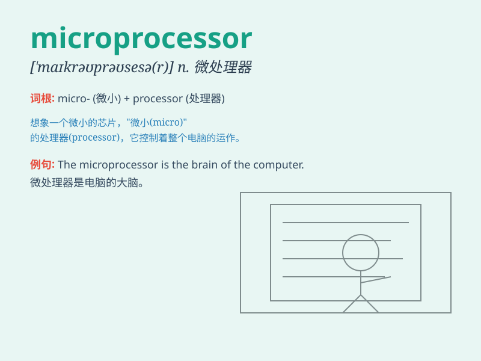

## microprocessor

**英音:** _[maɪkrə(ʊ)\'prəʊsesə]_ **美音:**
_[,maɪkro\'prosɛsɚ]_

**译义:** *n.[计]微处理器*

### 短语

+ **embedded microprocessor:** _嵌入式微处理器_

+ **microprocessor system:** _微处理器系统_

+ **single-chip microprocessor:** _单片微处理器_

+ **microprocessor architecture:** _微处理器架构_

+ **high-performance microprocessor:** _高性能微处理器_

### 例句

#### 例句1

> **The microprocessor is the heart of a computer system.**

**中文翻译:** 微处理器是计算机系统的核心。

**单词释义:** 微处理器

#### 例句2

> **This new device incorporates a highly advanced
microprocessor.**

**中文翻译:** 这种新设备采用了非常先进的微处理器。

**单词释义:** 微处理器

#### 例句3

> **The speed of the microprocessor determines the performance of the
electronic device.**

**中文翻译:** 微处理器的速度决定了电子设备的性能。

**单词释义:** 微处理器

### 背诵小故事

> Imagine a tiny world where a super-small hero called \'Micro\' is in
charge of processing all the important tasks. This hero is the
\'microprocessor\', handling everything with speed and precision.

**想象一个微小的世界，有一个超级小的英雄叫"微"，负责处理所有重要的任务。这个英雄就是"微处理器"，快速且精确地处理一切。**

### 图义

