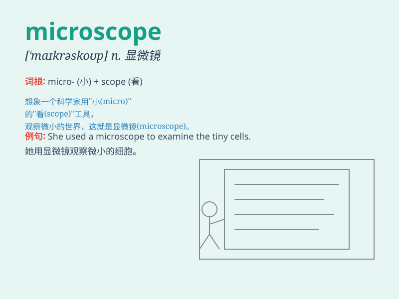

## microscope

**英音:** _[\'maɪkrəskəʊp]_ **美音:** _[\'maɪkrəskop]_

**译义:** *n.显微镜*

### 短语

+ **electron microscope:** _电子显微镜_

+ **optical microscope:** _光学显微镜_

+ **scanning microscope:** _扫描显微镜_

+ **microscope slide:** _显微镜载玻片_

+ **compound microscope:** _复式显微镜_

### 例句

#### 例句1

> **The scientist observed the cells through a microscope.**

**中文翻译:** 科学家通过显微镜观察了细胞。

**单词释义:** 显微镜

#### 例句2

> **She used a powerful microscope to examine the tiny insects.**

**中文翻译:** 她使用强大的显微镜来检查这些微小的昆虫。

**单词释义:** 显微镜

#### 例句3

> **The microscope revealed details that were previously unseen.**

**中文翻译:** 显微镜揭示了以前未曾见过的细节。

**单词释义:** 显微镜

### 背诵小故事

> One day, a scientist was very excited because he found a new
MICROSCOPE. With it, he could observe tiny creatures that were invisible
to the naked eye. It was like opening a door to a mysterious micro
world.

**有一天，一位科学家非常兴奋，因为他发现了一个新的显微镜。有了它，他能够观察到肉眼看不见的微小生物。这就像打开了通往神秘微观世界的大门。**

### 图义

