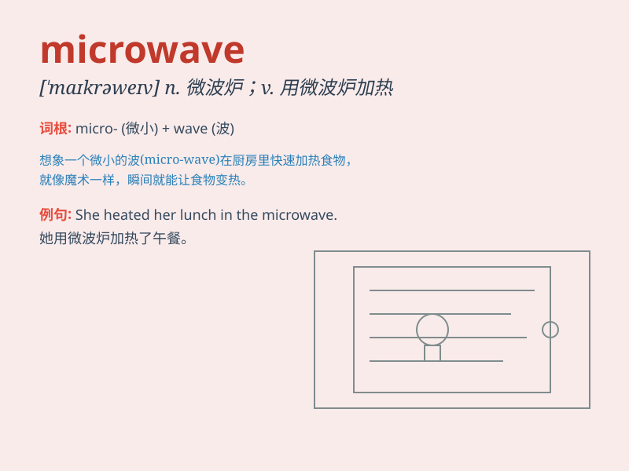

## microwave

**英音:** _[\'maɪkrə(ʊ)weɪv]_ **美音:**
_[\'maɪkrə\'wev]_

**译义:** *n.微波(波长为1毫米至30厘米的高频电磁波)*

### 短语

+ **microwave oven:** _微波炉_

+ **microwave radiation:** _微波辐射_

+ **microwave frequency:** _微波频率_

+ **microwave technology:** _微波技术_

+ **microwaveable food:** _可微波加热的食品_

### 例句

#### 例句1

> **I heated the soup in the microwave.**

**中文翻译:** 我用微波炉加热了汤。

**单词释义:** 微波炉；用微波炉加热

#### 例句2

> **The microwave oven broke down yesterday.**

**中文翻译:** 微波炉昨天坏了。

**单词释义:** 微波炉

#### 例句3

> **She defrosted the meat in the microwave.**

**中文翻译:** 她用微波炉解冻了肉。

**单词释义:** 用微波炉加热

### 背诵小故事

> One day, I was very hungry. I put a pizza in the microwave to heat it
quickly. The microwave made a buzzing sound and soon my pizza was warm
and ready to eat.

**有一天，我非常饿。我把一个披萨放进微波炉里快速加热。微波炉发出嗡嗡声，很快我的披萨就热好了可以吃了。**

### 图义

